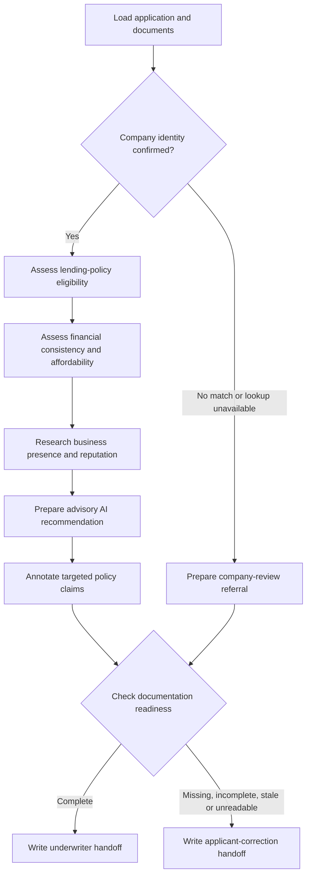

# FIONAA on AWS

FIONAA is an AI-assisted business lending assessment workflow built with LangGraph and Amazon Bedrock AgentCore. It combines application details, prepared financial and identity documents, Companies House checks, business web research, and lending policies into an evidence-backed report for a human underwriter.

**Every completed assessment remains pending human review.** The AI provides an advisory recommendation; it does not approve or reject a loan. A separate, deterministic readiness check records whether the submission is ready for underwriting or needs corrections from the applicant.

This repository contains the Python application, AWS infrastructure configuration, policy definitions, evaluation tooling, CI workflows, and a standalone dashboard mockup.

## What the application does

The application supports five lending products:

- Unsecured business loans
- Secured business loans
- Revolving credit facilities
- Invoice factoring
- Invoice discounting

Each product has a bundled [lending policy](fionaa/app/src/fionaa/policies/). The workflow loads prepared JSON documents from S3, performs assessments, and stores the findings and review report under the application's customer-scoped prefix.

The current implementation consumes extracted document data; it does not extract information from uploaded PDFs. Its terminal nodes write handoff artifacts for downstream consumers. They do not send applicant notifications, enqueue underwriting work, or capture a human's final lending decision.

## Assessment workflow

The diagram follows the current [graph topology](fionaa/app/src/fionaa/graph.py). Labels describe behaviour; the code retains some historical node names.



Company verification runs before the other assessments. If the company cannot be confirmed, the workflow prepares a referral and still checks documentation readiness. The historical `reject_no_company` node does not automatically reject the application.

On the assessment path, Automated Reasoning checks code-generated assertions about substantive eligibility, documentation completeness, and the recommendation's policy consistency, where those assertions can be formed. Results annotate the report as `valid`, `invalid`, `inconclusive`, or `not_checked`. These checks do not validate every narrative statement or determine the lending outcome.

Readiness routing is independent of the recommendation and claim-check results. Its current checklist covers application details, director ID, proof of address, bank statements, and annual accounts. Product-specific supporting documents are also loaded where configured, but the readiness checklist does not yet enforce every product-specific requirement.

## Architecture

| Component | Role in this project |
| --- | --- |
| LangGraph | Assessment sequencing, branching, checkpointed state, and per-invocation dependencies |
| AgentCore Runtime | Hosts the authenticated Python application |
| Amazon Bedrock | Supplies the assessment model and optional content guardrail |
| Bedrock Automated Reasoning | Separately checks targeted claims against configured product policies |
| AgentCore Gateway | Exposes Companies House, web-search, and location tools through MCP |
| AgentCore Memory | Stores graph checkpoints for application sessions |
| S3 and KMS | Store application inputs, evidence, and review artifacts |
| Cognito, STS, and Secrets Manager | Support caller authentication, scoped data access, and Gateway OAuth |
| OpenTelemetry | Instruments LangChain activity for tracing |

The runtime derives the customer identifier from the email in the JWT validated by its authorizer. It assumes a data-access role with a customer session tag, and S3 access is scoped to that customer's prefix. Checkpoint actor/thread identifiers are also derived from the application identity; their isolation is enforced by application code.

The model configuration lives in [model/load.py](fionaa/app/src/fionaa/model/load.py). Model content guardrails and the separate Automated Reasoning claim checks serve different purposes and have separate configuration.

See the [architecture guide and editable diagrams](fionaa/app/docs/architecture/README.md) for service boundaries and infrastructure source references. Some dependencies, including the shared Gateway and its external integrations, are managed outside this repository.

## Repository layout

```text
fionaa-aws/
├── README.md
├── fionaa/
│   ├── app/
│   │   ├── main.py                  # AgentCore source-archive bootstrap
│   │   ├── pyproject.toml           # Python package and dependencies
│   │   ├── src/fionaa/
│   │   │   ├── main.py              # Runtime entrypoint and dependency setup
│   │   │   ├── graph.py             # Graph topology
│   │   │   ├── domain/              # Application, document and assessment models
│   │   │   ├── workflow/            # Nodes, state, routing and resilience
│   │   │   ├── integrations/        # Checkpoint construction
│   │   │   └── policies/            # Shared and product-specific policy text
│   │   ├── tests/                  # Local regression tests and opt-in live tests
│   │   └── docs/                   # Architecture, handovers and dashboard mockup
│   ├── agentcore/
│   │   ├── agentcore.json          # Declarative AgentCore resource configuration
│   │   ├── aws-targets.json        # Deployment targets
│   │   ├── cdk/                    # Application and security infrastructure
│   │   ├── automated-reasoning/    # Policy definitions, provisioning and bindings
│   │   ├── evaluators/             # AgentCore evaluator definitions
│   │   └── lambda/                 # Geo-area matching tool
│   └── evals/
│       ├── datasets/               # Shared evaluation data Git submodule
│       ├── node/                   # DeepEval node evaluations and calibration
│       ├── automated_reasoning/    # Live policy-check runners and recorded results
│       └── runtime/                # Deployed-runtime evaluation tooling
├── ci-infra/                       # GitHub OIDC and evaluation CI infrastructure
├── .github/workflows/              # Evaluation, deployment and wiki automation
└── openwiki/                       # Generated repository evidence index
```

## Local development

The project's documented development and CI setup uses Python 3.13 and `uv`. AWS-backed development also needs Node.js, the AgentCore CLI, AWS credentials, and access to the configured services.

From the repository root, install the application and development dependencies:

```sh
cd fionaa/app
uv sync --group dev --python 3.13
uv run pytest tests
```

Live application tests are skipped by default. They require explicit `--run-live` selection and the relevant AWS/Gateway configuration. Local regression tests use fakes and mocks; passing them does not establish deployed-service behaviour.

To build the Python wheel, run `uv build --wheel` from `fionaa/app`. The package includes its policy Markdown files. AgentCore's source archive instead uses `app/main.py` to load the adjacent `src/` package.

### Evaluation dataset

The shared dataset is a Git submodule. Before running evaluations, initialise it from the repository root:

```sh
git submodule update --init --recursive
```

This requires access to the repository configured in [.gitmodules](.gitmodules). The dataset is then available at `fionaa/evals/datasets/fionaa_eval_dataset.jsonl`.

### Runtime configuration

The entrypoint reads deployment settings at invocation time. Configuration is supplied by the deployment or local environment; credentials and secrets should not be embedded in source files.

| Configuration | Purpose |
| --- | --- |
| `FIONAA_APPLICATIONS_BUCKET` | Application input and evidence storage |
| `FIONAA_POLICY_DOCS_BUCKET` | Policy-document store configuration required by the runtime context |
| `FIONAA_KMS_KEY_ARN` | Encryption key for stored artifacts |
| `FIONAA_DATA_ACCESS_ROLE_ARN` | Role assumed for customer-scoped data access |
| `FIONAA_CHECKPOINT_MEMORY_ID` | AgentCore checkpoint memory |
| `AGENTCORE_GATEWAY_URL` | MCP Gateway endpoint |
| `AGENTCORE_GATEWAY_CLIENT_ID`, `AGENTCORE_GATEWAY_CLIENT_SECRET_ARN` | OAuth client and Secrets Manager reference |
| `AGENTCORE_GATEWAY_TOKEN_ENDPOINT`, `AGENTCORE_GATEWAY_OAUTH_SCOPES` | Gateway token acquisition settings |
| `FIONAA_GUARDRAIL_ID`, `FIONAA_GUARDRAIL_VERSION` | Optional model content guardrail |
| `FIONAA_AR_GUARDRAILS` | Product-specific Automated Reasoning bindings |

Assessment policy text is loaded from the bundled `src/fionaa/policies/` files. See [Automated Reasoning setup](fionaa/agentcore/automated-reasoning/README.md) for the binding format and policy-version checks.

## Invocation and stored outputs

The runtime accepts an application reference, rather than a free-form chat prompt:

```json
{"application_id": "<existing-application-id>"}
```

The request must carry the appropriate authenticated context, and application inputs must already exist under `<customer_id>/<application_id>/input/` in the configured bucket. The caller does not supply the customer identity in the payload.

The response includes `application_id`, `outcome`, `route`, `decision_uri`, `triage_uri`, `handoff_uri`, and evidence URIs for assessment stages present in the final state. For a completed workflow, `outcome` is `pending_human_review`; `route` is either `underwriter` or `return_to_applicant`.

Artifact paths below are relative to the application's S3 prefix:

| Artifact | Contents |
| --- | --- |
| `input/application.json` | Application details |
| `companies_house/result.json` | Company verification evidence |
| `policy_check/result.json` | Eligibility and documentation findings |
| `financial_assessment/result.json` | Financial consistency and affordability assessment |
| `web_search/result.json` | Business research findings |
| `decision/proposed.json` | Advisory recommendation before claim annotation |
| `decision/validation.json` | Targeted policy-claim checks |
| `decision/triage.json` | Documentation-readiness findings and route |
| `decision/result.json` | Combined human-review report, including triage |
| `decision/to_underwriter.json` | Underwriter handoff with supporting assessment |
| `decision/to_applicant.json` | Applicant corrections without the internal credit assessment |

Only executed branches produce their corresponding artifacts. The company-referral branch skips policy, financial, web, synthesis, and live claim-validation stages.

## Evaluations and CI

| Layer | Purpose | Execution |
| --- | --- | --- |
| Application tests | Deterministic behaviour, schemas, routing, storage and security boundaries | Local pytest with mocked dependencies; live tests opt in |
| Node evaluations | Individual assessment quality, tool use and prompt-injection resistance | DeepEval with live model/tool calls |
| Automated Reasoning evaluations | Policy boundary cases and claim-check diagnostics | Standalone live runners |
| Runtime evaluations | Complete applications against the deployed runtime | Input staging, authenticated invocation and batch evaluation |

The [node CI workflow](.github/workflows/deepeval-ci.yml) provides advisory evaluation results on matching pull requests. The [runtime CI workflow](.github/workflows/evals-path2-batch-eval.yml) deploys and checks batch-evaluation results on matching pushes to `master`, or manual dispatch. A failed evaluation fails that workflow; this should not be read as an automatic deployment rollback.

Live evaluations make AWS and external tool calls. Follow the [evaluation guide](fionaa/evals/README.md), [node instructions](fionaa/evals/node/README.md), and [runtime evaluation runbook](fionaa/agentcore/EVALS.md) for configuration, execution order, and interpretation of results.

## AWS deployment

Review the configured account, region, existing dependencies, and resource definitions before deploying. From the repository root:

```sh
cd fionaa/agentcore
agentcore validate
agentcore deploy
agentcore status
```

These commands act on the configured AWS environment. The declarative [AgentCore configuration](fionaa/agentcore/agentcore.json) defines the project's AgentCore resources; [CDK infrastructure](fionaa/agentcore/cdk/) contains the supporting application and security setup. [CI infrastructure](ci-infra/) is maintained separately.

## Dashboard and further documentation

The [job dashboard](fionaa/app/docs/dashboard-mockup/README.md) is a standalone HTML visualization of recorded workflow steps and evidence. It is a review mockup, not a deployed underwriting portal. Its five business-stage groupings overlap the graph's execution nodes; they are not five sequential graph steps.

- [Application documentation](fionaa/app/README.md)
- [Architecture and editable diagrams](fionaa/app/docs/architecture/README.md)
- [Security and IAM policy notes](fionaa/app/fionaa_iam_policies.md)
- [Automated Reasoning policies and setup](fionaa/agentcore/automated-reasoning/README.md)
- [Evaluation overview](fionaa/evals/README.md)
- [Implementation handovers](fionaa/app/docs/handovers/)
- [Generated OpenWiki index](openwiki/index.md)

Handovers and architecture snapshots record particular implementation stages. Use current source code and tests to resolve differences with older descriptions. OpenWiki is generated by its scheduled workflow; update source documentation rather than hand-editing generated pages.
