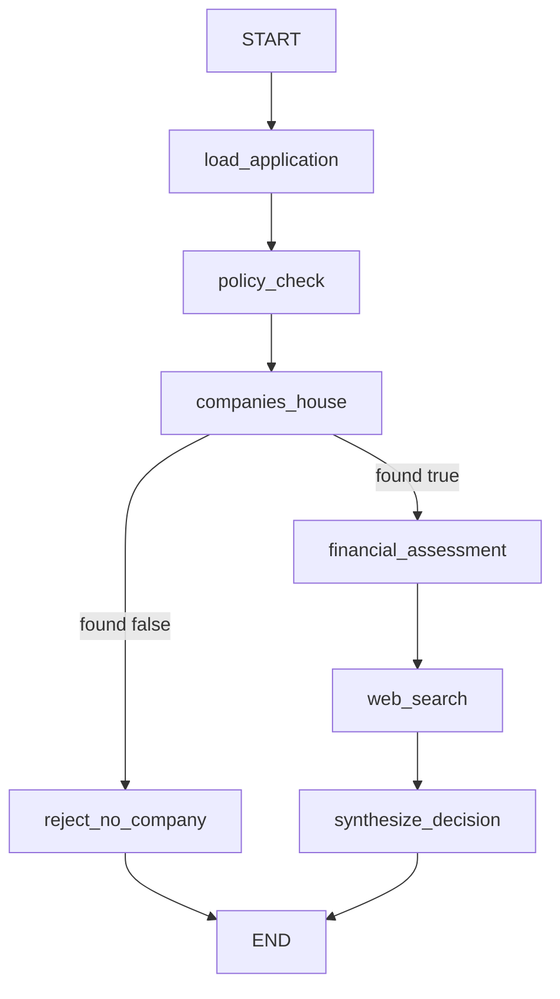

# Graph workflow and node responsibilities

FIONAA’s request handling is organized as a LangGraph state machine with two distinct data planes:

- **Checkpointed state**: the serializable application and result data that flows from node to node.
- **Runtime context**: per-invocation dependencies such as the S3-backed application store, policy-document store, and live tool objects.

That split matters because the graph is checkpointed for recovery and replay, but the runtime context is not part of the checkpoint. In practice, the graph persists business facts in state while keeping non-serializable or invocation-specific collaborators in `AgentContext`.

## State and runtime context

`ApplicationState` is a `TypedDict` with a last-write-wins merge strategy for the fields that are produced by downstream nodes. It carries the loaded application plus the outputs of each analysis node: policy check, Companies House lookup, financial assessment, web search, and the final decision. It also carries the staged document lists such as `annual_accounts` and `bank_statements`, which can contain multiple items per type.

`AgentContext` is the runtime companion schema registered on the graph. It holds the `ApplicationStore`, `PolicyDocStore`, and the current tool list. These objects are intentionally kept out of checkpointed state because they are invocation-scoped dependencies and not msgpack-friendly payloads.

The key operational rule is:

- **State is durable workflow data.** It is what later nodes re-read and what the checkpointer saves.
- **Runtime context is ephemeral execution scaffolding.** It is available to nodes during one run, but it is never serialized into the checkpoint.

That distinction is what allows the graph to keep evidence artifacts in S3 while still using a checkpointer for the graph state itself.

## Topology

The graph executes in a fixed order until it reaches the Companies House branch, where one node decides the next hop.

This diagram shows the canonical execution path and the single conditional branch.

## Node responsibilities in execution order

### 1. `load_application`

This node reads `input/application.json` from the runtime store and fails immediately if it is missing. It also discovers additional input documents by prefix under the same `input/` area, validating each JSON object against the expected schema before placing it in state.

Two invariants are important here:

- Documents are loaded by prefix, not by a manifest, so multiple annual accounts or bank statements can be staged.
- Invalid document JSON is not ignored; it fails the run so later assessments do not silently consume bad evidence.

The node returns the application plus the validated document lists, which become the starting point for downstream analysis.

### 2. `policy_check`

This node evaluates the application against the loan policy selected from the application’s loan type. It does not search for the policy document; policy selection is already resolved upstream by loan type.

It also scopes deterministic calculation tools from `CHECK_TOOLS_POOL` according to the policy metadata, so the model only sees the tools that policy explicitly authorizes. The node submits the application, policy text, and bank-statement end dates to the agent, then stores a structured `PolicyCheckResult`.

The node writes `policy_check/result.json` as evidence, including harvested tool calls. Those tool calls are recorded separately from the state so the downstream nodes still receive the clean structured result shape.

### 3. `companies_house`

This node performs the registered-company verification and is the workflow’s first branching point. It runs an agent constrained to `CompaniesHouseResult`, with Companies House tools and the geo-target helper available because the prompt expects it for address reconciliation.

The node performs two non-obvious controls after the model responds:

1. It extracts tool calls as evidence and redacts street-level address detail before persistence.
2. It applies a runtime groundedness check to the `found` claim.

That groundedness step is deliberately asymmetric: it can downgrade `found=True` to `found=False` if the tool evidence does not support the claim, but it never upgrades a false claim into a true one. This makes the branch decision safer, because a fabricated company match is what would otherwise let an unverified application proceed.

The node then returns a `Command` that updates state and routes to one of two paths:

- `financial_assessment` when `found` remains true.
- `reject_no_company` when `found` is false.

The node also persists `companies_house/result.json`, including the groundedness metadata and redacted tool calls.

### 4. `reject_no_company`

This is the terminal branch for applications that do not produce a confirmed Companies House match. It writes a single consolidated `decision/result.json` artifact and returns a rejection decision with reason `companies_house_no_match`.

A subtle design choice here is that the artifact includes the earlier `policy_check` and `companies_house` results. That means a reviewer can understand why the run ended early without reconstructing the path from separate node outputs.

### 5. `financial_assessment`

This node is only reachable after a positive Companies House branch. It uses the application, Companies House findings, policy check result, annual accounts, and bank statements to produce a structured financial assessment.

Before the agent runs, the workflow computes a deterministic cross-check of application figures against the most recent annual accounts. The agent is instructed to copy that cross-check through verbatim rather than recomputing the delta itself. That keeps the numeric comparison authoritative and avoids having the model re-derive materiality.

The node also passes the financial documents read from state, which means it can reason over multiple annual accounts or multiple bank statements if they were staged. The result is persisted as `financial_assessment/result.json` together with tool-call evidence.

### 6. `web_search`

This node runs after financial assessment on the success path. It uses the company name plus the Companies House findings to search for online corroboration such as a company site or a related profile.

Unlike the Companies House node, the web-search evidence is audit-only. The node records whether it actually used a tool, but that groundedness signal does not affect routing. The node returns the raw search result string in state because the final synthesis node expects that shape.

It persists `web_search/result.json` with the search result, the redacted tool calls, and a boolean indicator showing whether the search was tool-backed.

### 7. `synthesize_decision`

This is the final synthesis node on the success path. It does not re-fetch data or re-run checks; it reads the upstream results already stored in state and asks the model for a final structured decision.

The node exists because the success path otherwise would have ended after collecting evidence, without any consolidated outcome. It writes `decision/result.json` containing the final verdict plus the upstream policy, Companies House, financial assessment, and web-search findings that informed it.

## Persistence model

Each major node writes a node-specific evidence artifact under a fixed path in the application store:

- `policy_check/result.json`
- `companies_house/result.json`
- `financial_assessment/result.json`
- `web_search/result.json`
- `decision/result.json`

These artifacts are separate from the checkpointed state. The state is what LangGraph can resume from; the artifacts are the reviewable evidence trail. That separation is also why tool calls are stored in the S3 artifacts rather than in the structured state objects that downstream prompts read.

## Branching and failure behavior

The graph has three meaningful early-failure or early-completion behaviors:

- Missing `input/application.json` fails at `load_application`.
- Invalid staged document JSON fails at `load_application` during schema validation.
- A negative Companies House verification branches directly to `reject_no_company`, which ends the run after writing the rejection artifact.

The Companies House branch is the only conditional route in the graph. Everything else is linear, which keeps the workflow predictable: once the company is confirmed, the graph always proceeds through financial assessment, web search, and final synthesis before ending.

## Extension points

The graph is designed so new document types can be added to `DOCUMENT_SPECS` without changing `load_application` control flow. A spec can gate on application content via `applies_to`, which allows future loan types or document requirements without adding branching logic to the loader.

The same design applies to tools:

- Policy checks pull only the deterministic tools named by policy metadata.
- Companies House and web search receive only the tool prefixes they are meant to use.

That keeps the graph modular: each node gets the smallest execution surface needed for its own responsibility.

## Tests that matter

The unit tests in `tests/test_graph.py` capture the behavioral contracts that are easiest to break accidentally:

- `checkpoint_config` derives thread and actor scoping from the verified identity.
- `load_application` reads the application, loads documents by prefix, skips inapplicable document specs, and fails on invalid JSON.
- `check_against_policy` scopes tools by loan type, passes bank-statement end dates, and persists tool-call evidence.
- `check_companies_house` preserves the branch contract, persists redacted evidence, and honors groundedness overrides.
- `reject_no_company` consolidates the early termination decision.
- `synthesize_decision` is the final success-path rollup.

Those tests matter because they encode the graph’s invariants: routing is based on structured results, evidence is persisted separately from state, and the success path always ends in a synthesized decision rather than an open-ended evidence collection phase.
