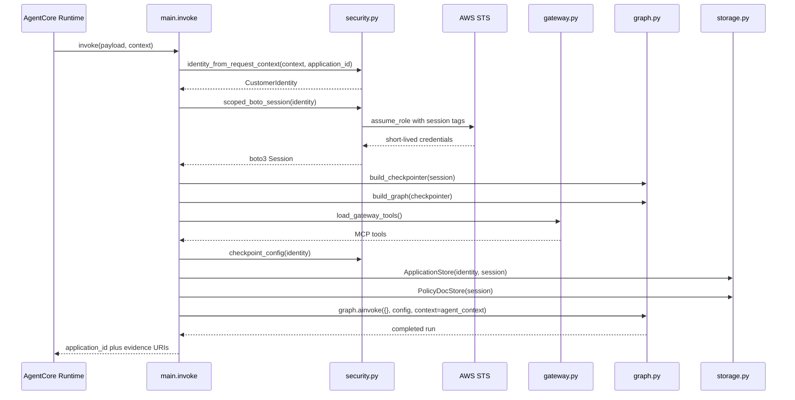

# Runtime entrypoint and invocation flow

The runtime entrypoint is the boundary where an AgentCore invocation turns into a LangGraph run. It is responsible for deriving trusted identity from the request context, building customer-scoped AWS credentials, loading fresh gateway tools, creating the graph checkpointer, and returning stable S3 URIs for the per-run evidence artifacts.

This page focuses on the control flow at the top of the stack, not the internal reasoning of the graph nodes. For node-by-node workflow details, see [Graph workflow and node responsibilities](/openwiki/architecture/graph-workflow.md).

## What comes from verified identity, and what does not

The runtime is explicit about the trust boundary:

- **Derived from verified request identity**: `customer_id`, `application_id` as the checkpoint scope, `thread_id`, and the session tags used for the data-access role.
- **Read from the caller payload**: `application_id` only as a lookup key passed into identity derivation and used to locate the application record; the runtime does not accept caller-provided identity fields as authoritative.
- **Runtime-scoped, not checkpointed**: the boto3 session, the S3-backed application store, policy-doc store, gateway tool list, and checkpointer instance.
- **Checkpointed graph state**: the LangGraph state written and resumed by the checkpointer.

That split matters because the runtime-scoped objects exist only for one invocation, while checkpointed state can survive pause, resume, or replay.

## End-to-end request path

1. AgentCore receives the invocation and enters `invoke` in `main.py`.
2. `identity_from_request_context` extracts the validated JWT from `context.request_headers`, derives `customer_id` by hashing the verified email claim, and pairs it with the request's `application_id`.
3. `scoped_boto_session` assumes `FionaaDataAccessRole` with session tags for `customer_id` and `application_id`, yielding short-lived credentials that are tagged for S3 prefix isolation.
4. `build_checkpointer(session)` creates `AgentCoreMemorySaver` from the scoped session credentials so checkpoint access is also bound to the verified identity.
5. `build_graph(checkpointer=...)` compiles the LangGraph workflow for this invocation.
6. `load_gateway_tools()` fetches a fresh Gateway OAuth token and loads MCP tools from `AGENTCORE_GATEWAY_URL` per invocation, rather than caching them at module import time.
7. `checkpoint_config(identity)` derives `thread_id` and `actor_id` from the verified identity. These values are not accepted from the caller payload.
8. `AgentContext` is assembled with a customer-scoped `ApplicationStore`, a `PolicyDocStore`, and the freshly loaded tools.
9. `graph.ainvoke({}, config, context=agent_context)` starts the workflow with an empty initial state. The runtime context carries the scoped collaborators; the checkpointer manages resumable graph state.
10. When the graph completes, `invoke` returns URIs for the evidence artifacts stored under the customer/application prefix in S3.

## Invocation sequence

The diagram shows the runtime-control path only. The graph's internal node sequence is documented on the workflow page.

## Entry-point responsibilities

### `main.invoke`

`invoke` is the only runtime entrypoint. It coordinates the full request-to-run path:

- derives identity from the verified request context,
- builds the customer-scoped boto session,
- constructs the checkpointer from that session,
- loads gateway tools fresh for the invocation,
- creates `AgentContext`,
- invokes the graph, and
- returns S3 URIs for the artifacts that external callers can inspect.

The function returns a compact response object rather than the full graph state. The response contains:

- `application_id`
- `policy_check_uri`
- `companies_house_uri`
- `web_search_uri`

Those URIs point at the evidence trail under `s3://<applications-bucket>/<customer_id>/<application_id>/...`.

### `identity_from_request_context`

Identity resolution is based on the validated JWT that AgentCore places on the request context. The code reads the bearer token from `context.request_headers`, decodes it without re-verifying the signature, and extracts the email claim. The derived `customer_id` is a SHA-256 hash of the normalized email, which avoids persisting raw email in S3 prefixes or session tags.

This is a deliberate trust boundary:

- the runtime trusts the validated inbound request context,
- the runtime does not trust a caller-supplied `customer_id`, and
- the hash is computed inside the application so the algorithm is controlled by the runtime.

### `scoped_boto_session`

The runtime creates a boto3 session by assuming `FionaaDataAccessRole` with session tags for `customer_id` and `application_id`. The session is short-lived and refreshable, so longer workflows can re-assume the role when needed.

The important invariant is that the application code never falls back to the ambient execution role for customer data access. Customer-scoped AWS credentials are created once per invocation and then threaded into the store and checkpointer builders.

### `build_checkpointer`

The checkpointer is created from the scoped session credentials, not from module-global credentials. This means checkpoint reads and writes are tied to the same customer-scoped execution boundary as the S3 stores.

The code uses `AgentCoreMemorySaver` for resumable graph state, but the runtime still treats checkpoint data as operational recovery state rather than the durable evidence record. The reviewable evidence lives in S3 artifacts written by the nodes.

### `load_gateway_tools`

Gateway tools are loaded fresh for each invocation because the OAuth access token is short-lived. The runtime does not cache the MCP client or the tools at module load.

This prevents stale tokens from leaking across runs and keeps the runtime's tool surface aligned with the current invocation.

### `checkpoint_config`

`checkpoint_config(identity)` derives `actor_id` and `thread_id` from verified identity fields. The code intentionally keeps these values out of the payload so callers cannot choose their own checkpoint namespace.

That rule is important because checkpoint scoping must match the authenticated customer, not arbitrary request content.

### `AgentContext`

`AgentContext` is the runtime context object handed to the graph. It carries the customer-scoped `ApplicationStore`, the shared `PolicyDocStore`, and the freshly loaded tool list.

These are runtime-scoped collaborators, not workflow state. The graph nodes may use them during the invocation, but they are not part of the checkpointed state image.

## Response URIs and evidence layout

The entrypoint returns S3 URIs rather than raw artifact contents. The URI prefix is built from the verified identity:

` s3://<applications-bucket>/<customer_id>/<application_id> `

The returned fields are the primary evidence entry points for external systems:

- `policy_check_uri` → `.../policy_check/result.json`
- `companies_house_uri` → `.../companies_house/result.json`
- `web_search_uri` → `.../web_search/result.json`

The graph also writes other artifacts, including `financial_assessment/result.json` and `decision/result.json`. Those are part of the same S3 prefix even though they are not returned directly by the entrypoint.

## Operational invariants and failure behavior

The entrypoint is intentionally narrow, but it still enforces several important invariants:

- Identity comes from the request context, not the payload.
- Checkpoint scoping comes from the verified identity, not caller input.
- Gateway tools are loaded fresh per invocation.
- The graph is compiled per invocation with the caller's scoped checkpointer.
- S3 evidence is written under the identity-derived prefix.

Common failures surface early in the runtime boundary:

- missing or invalid authorization context prevents identity derivation,
- unsafe identity values are rejected before they become session tags,
- credential or role-assumption failures stop the run before graph execution,
- missing gateway configuration prevents tool loading, and
- graph failures propagate after the runtime has already established scoped context.

That ordering is useful operationally: the runtime fails before it can accidentally execute the workflow with unscoped credentials.

## Extension and change points

Most extension work happens by changing the collaborators the entrypoint wires together, not by changing the entrypoint itself:

- add or alter graph nodes in `build_graph`,
- change the S3-backed stores in `storage.py`,
- adjust identity or session-tag rules in `security.py`, or
- change gateway exposure in `gateway.py`.

When extending the runtime, preserve the boundary between verified identity and caller payload. Any new per-invocation collaborator that needs customer scope should be derived from the same verified identity, and any persistent workflow artifact should continue to live under the identity-derived S3 prefix.

## Focused tests that matter

The runtime boundary is covered by tests that exercise the contracts most likely to regress:

- identity is derived from the verified request context,
- `checkpoint_config` uses verified identity for `actor_id` and `thread_id`,
- the graph is built with a provided checkpointer,
- gateway tools are loaded per invocation, and
- response URIs are built from the identity-derived S3 prefix.

Those tests matter because they guard the trust boundary and the separation between runtime context and checkpointed state.
