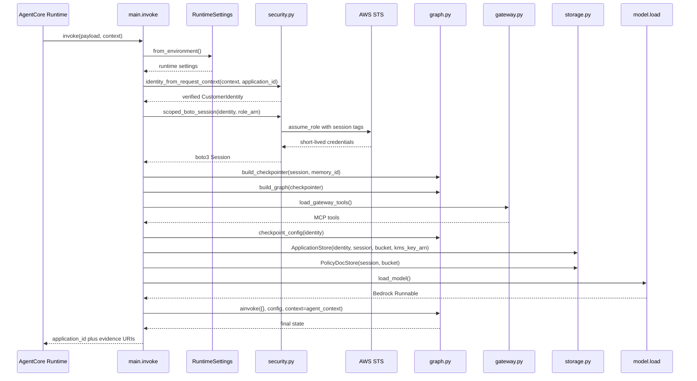

# Runtime entrypoint and invocation assembly

The runtime entrypoint is the boundary where a Bedrock AgentCore request becomes a configured LangGraph invocation. Its job is to derive trusted identity from the request context, assemble per-invocation dependencies with customer scope, execute the graph with checkpointing, and return stable S3 URIs for the evidence artifacts.

This page documents request-time dependency assembly, not package layout or node internals. For node-by-node workflow behavior, see [Graph workflow and stage sequencing](/openwiki/architecture/graph-workflow.md).

## What is per invocation and what is module level

The runtime keeps a strict split between objects created for one request and objects created when the module is imported:

- **Per invocation**: `RuntimeSettings`, `CustomerIdentity`, the scoped boto3 session, the checkpointer, the graph binding, gateway tools, `checkpoint_config`, `AgentContext`, and the `graph.ainvoke(...)` call.
- **Module level**: the `BedrockAgentCoreApp` instance, telemetry instrumentation, and imported helper functions and classes.

That split matters because customer scope, bearer tokens, and checkpoint namespace must be derived fresh for each request, while module-level setup should remain free of customer-specific state.

## Trust boundary

The runtime keeps a strict separation between verified identity and caller input:

- `identity_from_request_context` derives `customer_id` from the verified JWT email claim on the request context and requires the caller-provided `application_id` as the application lookup key.
- `scoped_boto_session` assumes `FionaaDataAccessRole` with session tags for `customer_id` and `application_id`, so customer data access is mediated by short-lived, tagged credentials rather than the ambient execution role.
- `checkpoint_config(identity)` derives `actor_id` and `thread_id` from verified identity, keeping checkpoint scope out of the payload.
- `ApplicationStore` builds S3 keys from the verified identity, not from caller-controlled path fragments.

That boundary prevents ambient credentials or payload fields from choosing customer scope.

## Request-time assembly

`invoke` in `main.py` is the runtime entrypoint. Each invocation performs the same sequence:

1. Load `RuntimeSettings` from environment variables.
2. Derive verified identity from `context.request_headers` and `payload["application_id"]`.
3. Assume the data-access role with customer/application session tags.
4. Build an `AgentCoreMemorySaver` checkpointer from the scoped session.
5. Compile the graph with that checkpointer.
6. Load gateway tools fresh for the invocation.
7. Build checkpoint config from verified identity.
8. Assemble `AgentContext` with the scoped `ApplicationStore`, the shared `PolicyDocStore`, the fresh tools, the loaded model, and the policy checker.
9. Invoke the graph with empty initial state and the runtime context.
10. Return a compact response containing the `application_id`, the decision outcome, the route, and artifact URIs rooted at the verified identity.

The diagram shows the request-time control path only. The graph’s internal node sequence is documented on the workflow page.

## Runtime components and responsibilities

### `RuntimeSettings`

`RuntimeSettings.from_environment()` reads the required runtime configuration explicitly at invocation time. The entrypoint depends on environment values for the applications bucket, policy-doc bucket, KMS key ARN, data-access role ARN, and checkpoint memory ID.

This keeps configuration visible and fail-fast: missing configuration raises before any graph execution begins.

### `identity_from_request_context`

Identity is derived from the validated request context rather than from payload fields. The function reads the bearer token from `context.request_headers`, decodes the JWT without re-verifying the signature, and extracts the email claim used to hash `customer_id`.

The important invariant is that the caller does not supply `customer_id`. The runtime computes it itself so the identity scheme stays under application control.

### `scoped_boto_session`

The runtime creates a boto3 session by assuming `FionaaDataAccessRole` with `customer_id` and `application_id` session tags. Those tags scope S3 access and are renewable through `DeferredRefreshableCredentials`, which allows long-running runs to re-assume the role as needed.

This is the primary AWS boundary for customer data access: the runtime should never fall back to the ambient execution role for application storage or checkpoint access.

### `build_checkpointer`

`build_checkpointer` constructs `AgentCoreMemorySaver` from the invocation’s scoped session credentials. Checkpoint reads and writes therefore use the customer-scoped session, not an unscoped process-wide credential set.

Checkpointed state is operational recovery state for LangGraph, distinct from the durable evidence artifacts stored in S3.

### `load_gateway_tools`

Gateway tools are loaded fresh for each invocation. `load_gateway_tools()` fetches a new Gateway OAuth access token and creates an MCP client from `AGENTCORE_GATEWAY_URL`, then resolves the tools for that run.

This avoids stale token reuse and keeps the tool set aligned with the current invocation instead of a module-level cache.

### `checkpoint_config`

`checkpoint_config(identity)` derives `actor_id` and `thread_id` from verified identity fields. The runtime intentionally keeps those values out of the payload so callers cannot select their own checkpoint namespace.

### `AgentContext`

`AgentContext` carries the runtime-scoped collaborators passed to the graph: the customer-scoped `ApplicationStore`, the shared `PolicyDocStore`, the fresh tool list, the loaded model, and the policy checker.

Those collaborators are runtime dependencies, not checkpointed graph state. The graph checkpoints the workflow state separately.

## Response shape and evidence layout

The entrypoint returns a compact response object rather than the full graph state. The response includes:

- `application_id`
- `outcome`
- `route`
- `decision_uri`
- `triage_uri`
- `handoff_uri`
- `companies_house_uri` when that stage produced output
- `policy_check_uri` when that stage produced output
- `financial_assessment_uri` when that stage produced output
- `web_search_uri` when that stage produced output

All returned URIs are rooted at:

`s3://<applications-bucket>/<customer_id>/<application_id>`

That prefix is derived from verified identity, so the artifact layout follows the same customer/application boundary as the session tags and the application store.

## Invariants and failure behavior

The entrypoint enforces a few important operational invariants:

- verified identity determines customer scope,
- payload content is used only as the application lookup key,
- checkpointing uses the scoped session,
- gateway tools are loaded per invocation,
- the model is loaded per invocation,
- durable evidence lives under the identity-derived S3 prefix.

Failures usually surface before graph execution:

- missing runtime settings fail during environment loading,
- missing or invalid request context prevents identity derivation,
- unsafe identity values are rejected before they become session tags,
- STS or role-assumption failures stop the run before graph invocation,
- gateway configuration or OAuth failures prevent tool loading.

That ordering protects the workflow from running with unscoped or stale credentials.

## Extension points

Most runtime changes happen by changing the collaborators assembled by the entrypoint:

- adjust settings loading in `config.py`,
- change identity or session-tag rules in `security.py`,
- alter checkpoint wiring in `integrations/checkpointing.py`,
- change storage layout in `storage.py`,
- modify gateway exposure in `gateway.py`, or
- change model selection and guardrail wiring in `model/load.py`.

When extending the runtime, preserve the trust split between verified identity and caller payload. Any new customer-scoped collaborator should be derived from the verified identity, and any persistent output should continue to live under the identity-derived S3 prefix.

## Focused tests that matter

The tests that matter most are the ones that defend the runtime boundary:

- identity derivation uses the verified request context,
- `scoped_boto_session` applies customer/application session tags,
- `build_checkpointer` receives the scoped session,
- `checkpoint_config` derives checkpoint scope from verified identity,
- `load_gateway_tools` is invoked per runtime run,
- response URIs are built from the identity-derived prefix.

Those tests protect the system from accidental drift back toward ambient credentials or caller-controlled scope.
