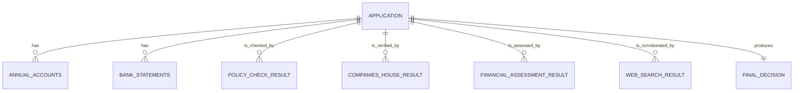
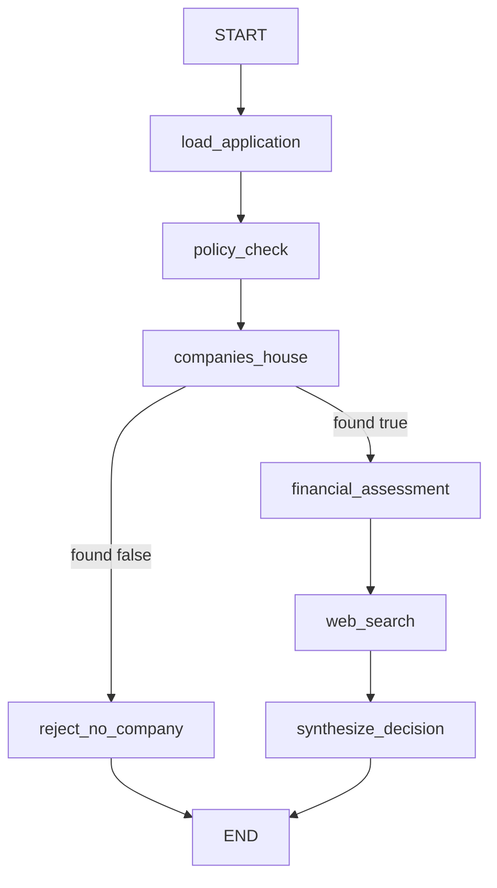

# Domain model and runtime data shapes

This page describes the few canonical shapes that FIONAA passes through the graph. The important distinction is not just *what* each object contains, but whether it is:

- **validated at the schema boundary** before it enters the workflow,
- **kept only in runtime context** for the current invocation,
- **stored in checkpointed graph state** so later nodes can re-read it, or
- **persisted as an evidence artifact** under the application store.

The graph is built around a small set of business objects:

- `application`
- `annual_accounts`
- `bank_statements`
- `companies_house`
- `policy_check`
- `financial_assessment`
- `web_search`
- `final_decision`

## Shape overview

This is not a database schema. It is the workflow shape: one application fans out into validated staged documents and a sequence of analysis results, then collapses into a final decision.

## Runtime vs persisted data

FIONAA uses two data planes:

- **Checkpointed state** carries the serializable values that later nodes need.
- **Runtime context** carries invocation-scoped collaborators such as `ApplicationStore`, `PolicyDocStore`, and live tools.

`AgentContext` is runtime-only. It is passed via LangGraph runtime context, not stored in `ApplicationState`, because the store and tool objects are not checkpoint-friendly. The checkpointed state contains only plain workflow data like the application payload, staged documents, and node outputs.

Each node also writes an evidence artifact to the application store. Those artifacts are separate from checkpoint state and are the reviewable record of what the run saw and decided.

## Application input

`ApplicationFormSchema` is the main application payload. It validates the business data that the graph uses to decide policy eligibility, Companies House verification, affordability, and final outcome.

The validated fields include:

- applicant and company identity fields such as `applicant_name`, `company_name`, `company_address`, and `director_*`
- lending fields such as `loan_type`, `loan_purpose`, `loan_amount`, and `loan_term`
- operating and affordability fields such as `annual_turnover`, `annual_profit`, `monthly_expenses`, `monthly_rent_or_mortgage`, and income/household values
- control and registration fields such as `companies_house_registered`, `industry`, `trading_start_date`, and `director_percentage_control`

The schema deliberately allows some economically meaningful negative values, such as `annual_profit` and `balance`, while enforcing non-negative ranges where a negative value would be invalid data rather than a real business condition. For example, `loan_amount`, `loan_term`, `annual_turnover`, `invoices_owed`, and several expense fields are bounded at validation time.

The application object itself is loaded from `input/application.json` and becomes the root of state for downstream nodes.

## Staged document lists

`annual_accounts` and `bank_statements` are staged as lists of validated JSON objects in state.

Important properties:

- They are discovered by prefix under `input/`, not by a manifest.
- Multiple documents per type are allowed and expected.
- Each document is validated before it enters state.
- Invalid document JSON fails the run instead of being dropped silently.

`AnnualAccountsSchema` captures the accounting-year snapshot used for cross-checking:

- company identity fields such as `company_name`, `director`, `registered_address`, and `registration_number`
- year fields such as `accounting_year`
- financial fields including turnover, operating profit, profit, debtors, tangible fixed assets, and cash at bank for current and prior years

`BankStatementSchema` captures the per-statement banking snapshot:

- account identity fields such as `account_owner`, `bank_name`, and `account_number`
- dates such as `start_date` and `end_date`
- financial fields such as `balance`, `payments_in`, and `payments_out`

The document lists remain in state so later nodes can reason over more than one annual account or statement when present.

## Structured result shapes

The analysis nodes return typed, structured results rather than free text. That matters because later routing decisions depend on predictable fields, and the persisted artifacts need machine-readable evidence.

### `CompaniesHouseResult`

This is the forced structured output for the Companies House verification node.

Fields:

- `found`: branch-driving boolean
- `confidence`: a coarse confidence label
- `summary`: explanation of the verification outcome

`found` is the routing field. The graph uses it to decide whether to continue to financial assessment or terminate early. The summary is constrained to avoid street-level address detail, so the persisted evidence and traces do not expose unnecessary PII.

### `PolicyCheckResult`

This is the policy eligibility result.

Fields:

- `eligible`: one of `eligible`, `ineligible`, or `inconclusive`
- `clause_findings`: itemized checks against specific policy clauses
- `documentation_gaps`: document-only shortfalls such as missing or stale statements
- `summary`: brief overall assessment

The separation between `eligible` and `documentation_gaps` is intentional: a missing document alone should not be conflated with substantive ineligibility.

### `FinancialAssessmentResult`

This is the consistency and affordability result.

Fields:

- `verdict`: one of `consistent`, `inconsistent`, or `inconclusive`
- `discrepancies`: non-numeric or narrative mismatches across sources
- `monthly_repayment`: the deterministic repayment figure when applicable
- `affordability_basis`: which evidence set the affordability view uses
- `affordability_verdict`: the human-readable affordability judgment
- `cross_check`: copied-through deterministic comparisons of application and annual-account figures
- `summary`: overall assessment

A key invariant is that the `cross_check` content is computed in code and copied through verbatim. The model is not expected to re-derive the numeric comparison itself.

### `FinalDecisionResult`

This is the success-path decision result.

Fields:

- `outcome`: one of `approved`, `rejected`, or `referred`
- `reason`: which upstream assessment drove the outcome
- `rationale`: the overall weighing of the evidence

The final decision is the synthesized outcome of the upstream checks, not a fresh evidence search. The terminal rejection path uses the same persisted shape category, but with a hand-written rejection reason when Companies House fails.

## How state fields evolve through the graph

The graph is mostly linear. The only routing decision is the Companies House branch, and the branch outcome determines whether the graph ends early or continues to the success-path assessments.

## Persistence rules

The evidence artifacts are written under fixed paths in the application store:

- `policy_check/result.json`
- `companies_house/result.json`
- `financial_assessment/result.json`
- `web_search/result.json`
- `decision/result.json`

A few practical consequences follow from that design:

- structured results stay clean in graph state for downstream nodes
- tool calls are harvested from model responses and stored only in the artifact, not in the state value
- the success path always ends in a consolidated `decision/result.json`
- the rejection path also writes `decision/result.json`, so reviewers have one terminal artifact regardless of outcome

## Invariants and failure modes

The model and graph enforce a few important invariants:

- Missing `input/application.json` fails immediately.
- Invalid staged document JSON fails validation and stops the run.
- `companies_house.found` is not trusted blindly; runtime groundedness can downgrade an unsupported positive claim to `False`.
- `web_search` records whether tool evidence was present, but that signal is audit-only and does not affect routing.
- The checkpointed state must remain msgpack-serializable, so runtime-only collaborators stay in `AgentContext`.

Those are the behaviors that matter when changing the domain model safely.

## Practical change boundaries

When extending the workflow, prefer these boundaries:

- add new document types as additional document specs and schemas
- keep new invocations-scoped dependencies in runtime context
- keep routing decisions on structured fields, not free-text summaries
- persist evidence separately from the state object that later nodes read

That keeps the graph auditable, checkpointable, and predictable.
