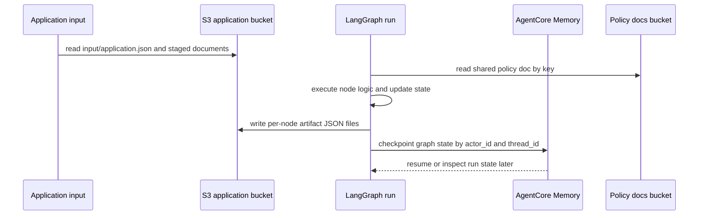

# Persistence and published artifacts

FIONAA uses two persistence channels with different jobs:

- **S3 application storage** holds customer-scoped inputs and the published artifacts that audit each workflow stage.
- **AgentCore Memory checkpointing** holds LangGraph execution state so a run can resume or be inspected later.

The separation is intentional. Checkpoints are operational state; S3 artifacts are the durable record that callers and dashboards can read back.

## Storage contract and scope

`ApplicationStore` is the only code path that reads and writes application-bucket objects. It derives every object key from the verified `CustomerIdentity` prefix:

`{customer_id}/{application_id}/...`

Callers do not provide full S3 paths. They pass relative keys such as `input/application.json` or `policy_check/result.json`, and the store prepends the verified customer/application prefix before making the S3 call. `list_keys()` also stays inside that scoped prefix and returns keys relative to it, which is how the loader discovers staged documents without exposing bucket layout to higher layers.

The application bucket carries three distinct kinds of data:

- `input/application.json` — the primary application payload.
- staged input documents under `input/`, including repeated `input/annual_accounts_*.json` and `input/bank_statement_*.json` files discovered by prefix.
- node evidence artifacts such as `policy_check/result.json`, `companies_house/result.json`, `financial_assessment/result.json`, `web_search/result.json`, `decision/proposed.json`, `decision/validation.json`, and `decision/result.json`.

`PolicyDocStore` reads shared policy documents from a separate bucket. Those documents are not customer-scoped because they are shared read-only policy assets rather than application data.

## Checkpointed graph state

`build_checkpointer()` constructs an `AgentCoreMemorySaver`, and `checkpoint_config()` maps verified identity to checkpoint scope with:

- `actor_id = customer_id`
- `thread_id = application_id`

So the code treats checkpoint access as application-scoped, while the actual state is stored in AgentCore Memory rather than in S3.

The checkpointed state is defined by `ApplicationState`. It intentionally contains the graph’s business state, not live runtime objects. The runtime context holds the S3 store, policy document store, tools, and model handles because those objects are not checkpoint-friendly and should not become part of persisted graph state.

In practice, checkpoint state captures things like:

- the loaded application payload
- validated annual accounts and bank statements
- policy, Companies House, financial, web-search, and decision outputs
- the branch-relevant values the graph needs to continue execution

It does **not** store the live clients or tool handles used to produce those values.

## Loading staged documents

`load_application()` first reads `input/application.json`, then discovers optional or repeated staged documents by prefix:

- `input/annual_accounts`
- `input/bank_statement`

There is no manifest that declares how many such documents exist. Discovery is prefix-based, and every discovered JSON document is schema-validated before it is returned.

Failure behavior is strict:

- if `input/application.json` is missing, `load_application()` raises `FileNotFoundError`
- if a discovered staged document fails schema validation, the loader raises `ValueError` and stops the run
- missing optional staged documents are returned as empty lists rather than being fabricated

This matters because downstream financial checks assume the loader either returned valid documents or failed loudly.

## Stage-by-stage artifact contract

Each workflow stage has a different persistence responsibility.

### Input loading

Loading stages populate checkpointed state from S3 inputs, but they do not publish review artifacts. Their job is to shape the graph state that later nodes will consume.

### Companies House stage

`check_companies_house()` writes `companies_house/result.json` after it has produced the structured `CompaniesHouseResult`.

That artifact intentionally includes more than the normalized graph state:

- the structured Companies House result copied from the agent output
- redacted raw tool-call records from the Companies House tools and the address-check tool
- runtime groundedness metadata (`grounded` and `grounding_reasons`)

The graph state keeps only the normalized `companies_house` result and the boolean branch signal used for routing. The richer tool trace lives only in S3 evidence so downstream prompts do not have to carry raw tool payloads.

### Validation stage

`validate_final_decision()` writes `decision/validation.json` before it publishes the final report.

That validation artifact is separate from the decision artifact. It records:

- the policy SHA used for the check
- per-claim annotations over the decision and policy findings
- counts by validation status
- the evidence snapshot used for the checks

The validation step does not change the loan outcome. It adds annotations that a human reviewer can inspect alongside the published decision.

### Decision stage

The workflow publishes two decision artifacts:

- `decision/proposed.json` contains the AI recommendation together with the upstream assessment inputs that produced it.
- `decision/result.json` contains the human-review report that callers should treat as the final published decision object.

`reject_no_company()` also writes `decision/result.json`, but with a minimal human-review report for the branch where no matching company was found.

The final report always exposes a reviewer-facing structure, not a raw model response. `human_review_report()` strips the recommendation into `ai_recommendation`, forces `outcome` to `pending_human_review`, and optionally attaches the validation artifact. That makes the final persisted decision explicit about what is advisory versus what still requires human action.

## How tools, notes, proposed decisions, annotations, and URIs are separated

The persistence model keeps these concepts distinct:

- **Tool calls** are raw evidence from the agent run. They are preserved in node-specific S3 artifacts when needed, but they are not part of the checkpointed graph state.
- **Grounding notes** are runtime evidence that can override or qualify a node result; in the Companies House stage they are attached to the S3 artifact as groundedness metadata, not to the branch-only checkpoint state.
- **Proposed decisions** live in `decision/proposed.json` and represent the model’s advisory synthesis plus upstream findings.
- **Validation annotations** live in `decision/validation.json` and record per-claim review results for the proposed or final decision.
- **URIs** are returned by storage writes as `s3://...` references so callers can capture where an artifact was published without reconstructing keys themselves.

This is the main contract for readers: checkpointed state tells the workflow how to continue; published artifacts tell humans and dashboards what happened.

## How the dashboard rehydrates runs

The dashboard poller demonstrates the intended read path:

1. read the chronological checkpoint history from AgentCore Memory
2. reconstruct which node ran at each step
3. backfill that step with the node’s S3 evidence artifact when one exists

That means checkpoint history is the backbone of replay, but S3 artifacts supply the richer per-node evidence that is not stored in graph state.

## Failure and durability expectations

Callers should assume the following:

- S3 object reads are scoped to the verified customer/application prefix.
- Missing application input is a hard failure, not a partial success.
- Malformed staged input is a hard failure, not a skipped document.
- Evidence artifacts are written by workflow nodes, not by the checkpointing layer.
- Checkpointing must survive the presence of runtime-only clients and tools because those objects are not part of persisted graph state.

What callers should **not** assume:

- that checkpoint state contains the full audit trail
- that S3 artifacts alone are enough to resume a run
- that arbitrary bucket paths are accepted by the storage layer

## Focused tests

The tests cover the persistence invariants that matter most:

- `test_get_json_scopes_key_to_identity_prefix`
- `test_put_json_writes_kms_encryption_context_matching_customer_id`
- `test_list_keys_scopes_prefix_to_identity_and_strips_it`
- `test_policy_doc_store_reads_from_shared_bucket`
- `test_checkpoint_config_derives_from_identity`
- `test_load_application_returns_stored_application`
- `test_load_application_raises_when_missing`
- `test_load_application_loads_and_validates_documents`
- `test_load_application_raises_on_invalid_document`
- the graph tests that verify node artifacts and checkpoint-safe runtime context

In short: S3 stores durable inputs and published artifacts, AgentCore Memory stores resumable graph state, and the workflow keeps those boundaries separate on purpose.
