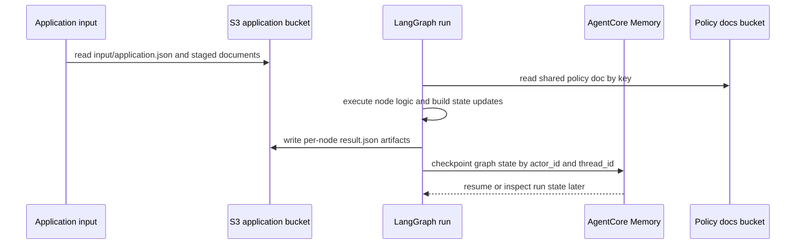

# Persistence, artifacts, and checkpointing

FIONAA splits persisted data into two different durability layers:

- **S3 application and evidence storage** holds the application inputs, policy documents, and per-node evidence artifacts.
- **AgentCore Memory checkpointing** holds the LangGraph execution state needed to resume or inspect a run.

That split is intentional. S3 stores the compliance and audit record. Checkpoint memory stores operational run state.

## What goes to S3

The only module that talks to S3 directly is `storage.py`. It scopes every application object key from the verified `CustomerIdentity`, so callers cannot choose arbitrary bucket paths.

### Application bucket

The application bucket contains customer-scoped inputs and outputs under the prefix:

`{customer_id}/{application_id}/`

Within that prefix, FIONAA stores:

- `input/application.json` — the application payload.
- `input/annual_accounts_*.json` — one or more annual accounts documents.
- `input/bank_statement_*.json` — one or more bank statement documents.
- `input/documents/<filename>` — large uploaded blobs, including application PDFs.
- per-node evidence artifacts such as:
  - `policy_check/result.json`
  - `companies_house/result.json`
  - `financial_assessment/result.json`
  - `web_search/result.json`
  - `decision/result.json`

Each `put_json()` call writes JSON with KMS server-side encryption and a KMS encryption context that matches the customer identity. `list_keys()` only lists keys under the verified prefix and returns keys relative to that prefix.

### Policy documents bucket

Policy documents live in a separate shared, read-only bucket. `PolicyDocStore` loads them by document key without customer scoping because the documents are shared policy assets, not application data.

This is the boundary between:

- **application input documents** in the application bucket
- **policy docs** in the policy bucket
- **evidence artifacts** generated by the run

## What goes into AgentCore Memory

`graph.py` builds the LangGraph checkpointer with `AgentCoreMemorySaver`.

The checkpointed data is the run’s graph state, not the raw evidence corpus. The code explicitly keeps storage dependencies out of the checkpointed state so the saved state stays msgpack-serializable and can be resumed safely.

The checkpoint identity is derived from the verified customer identity:

- `actor_id = customer_id`
- `thread_id = application_id`

That means checkpoint access is application-scoped in code, but the storage boundary is enforced by the graph’s own identity derivation rather than by an IAM prefix condition.

### Why checkpoint memory is different from S3

Checkpointing is for operational recovery:

- it preserves the sequence of graph state transitions
- it allows later replay or inspection of the run history
- it does not replace the S3 evidence artifacts

The run’s authoritative audit trail remains the per-node JSON written to S3.

## Per-node artifact structure

The graph writes one evidence artifact per substantive node. The code and tests show the following shape:

- `policy_check/result.json` stores the structured policy result plus `tool_calls` harvested from `ToolMessage` entries.
- `companies_house/result.json` stores the structured Companies House result, `tool_calls`, and grounding metadata.
- `financial_assessment/result.json` stores the structured financial result plus `tool_calls`.
- `web_search/result.json` stores the search result string, `tool_calls`, and a grounded flag.
- `decision/result.json` stores the final decision.

A key invariant is that some nodes persist **raw tool-call evidence alongside sanitized summaries**:

- the model-facing state often stays compact and schema-shaped
- the S3 artifact adds the raw evidence needed for later audit or dashboard replay
- redaction happens before persistence where needed, so tool-call payloads do not leak sensitive details

This is why the dashboard poller can enrich run history from S3: it reads the node’s own artifact and backfills evidence that is not present in the bare checkpoint state.

The diagram shows the split between S3-backed artifacts and checkpoint memory.

## Prefix discovery for staged documents

Application document loading is prefix-driven.

`load_application()` reads `input/application.json` first, then discovers additional staged documents by prefix:

- `input/annual_accounts`
- `input/bank_statement`

The loader validates every discovered JSON document against the expected schema.

Important consequences:

- there is **no manifest** listing how many staged documents exist up front
- the system expects multiple annual accounts and multiple bank statements
- discovery is based on key prefix, not on a fixed count or a single file name
- malformed documents fail the run rather than being silently skipped

That behavior matters operationally because downstream financial assessment depends on all staged documents being present and valid.

## Lifecycle and failure semantics

### S3 access

S3 reads for application data are constrained to the verified customer/application prefix. Missing objects are treated as absent data when appropriate; access denials are logged as security-significant events and re-raised.

### Evidence writes

Evidence artifacts are written at node completion time. The payload typically contains both the node’s normalized output and any raw tool calls required for auditability.

### Checkpoint writes

Checkpointing should succeed even when the graph context contains live clients or tool handles, because those objects are not part of the checkpointed state.

## Operationally important extension points

When adding a new persistence-producing node, decide three things explicitly:

1. **What belongs in checkpoint state** versus runtime context.
2. **Whether the node needs a dedicated S3 artifact path** under the application prefix.
3. **Whether raw tool-call evidence must be persisted** in addition to sanitized node output.

If a node loads staged input documents, it should follow the existing prefix-discovery pattern instead of introducing a manifest unless the file format truly requires one.

If a node emits audit evidence, it should write under its own fixed subpath so dashboard replay and later forensics can find it reliably.

## Focused tests that protect this design

The tests document the main invariants:

- `test_get_json_scopes_key_to_identity_prefix` verifies customer/application scoping.
- `test_put_json_writes_kms_encryption_context_matching_customer_id` verifies encryption-context handling.
- `test_list_keys_scopes_prefix_to_identity_and_strips_it` verifies prefix discovery and prefix stripping.
- `test_load_application_loads_and_validates_documents` verifies multi-document discovery without a manifest.
- `test_check_against_policy_persists_tool_calls_as_evidence` and related graph tests verify that raw tool-call evidence is stored in S3 artifacts.
- `test_build_graph_checkpoints_successfully_with_deps_in_context` verifies that runtime dependencies stay out of checkpointed state.
- `fetch_run.py` verifies the operational split by rehydrating history from checkpoint memory and backfilling richer evidence from S3.

In short: S3 stores the durable inputs and evidence; AgentCore Memory stores resumable state; and the graph deliberately bridges the two without mixing their responsibilities.
