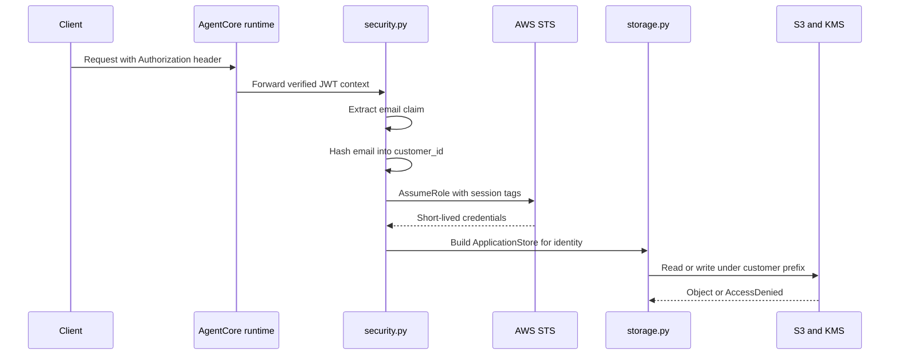

# Identity, IAM scoping, and storage safety

This page documents the trust boundary that keeps customer data isolated in FIONAA. The system does not accept a caller-provided customer identity. Instead, it derives a `customer_id` from verified JWT claims on the request context, uses that identity to assume a short-lived AWS role with session tags, and then constrains all application storage access to the matching S3 prefix and KMS encryption context.

The core rule is simple: identity comes from verified inbound auth, not from request payloads. Storage access is then shaped by that derived identity, not by ad hoc caller input.

## Identity derivation

`identity_from_request_context` reads the inbound `Authorization` bearer token from the AgentCore request context and decodes the JWT without verifying the signature in-process. That is intentional: the runtime authorizer is expected to validate the token before the request reaches this code, so the handler consumes already-verified claims instead of duplicating signature verification logic.

The function rejects malformed or incomplete inputs rather than guessing:

- missing `Authorization` header raises `ValueError`
- missing email claim raises `ValueError`
- the email claim is read from `email` or `custom:email`

`customer_id` is derived locally as `sha256(lowercased, trimmed email)`. This normalization ensures the same user maps to the same storage prefix even if the email casing or surrounding whitespace differs. It also keeps the raw email out of session tags and object keys.

`CustomerIdentity` validates both `customer_id` and `application_id` against the STS-safe tag character set before either value can be used downstream. That fails fast on malformed inputs instead of propagating dangerous strings into IAM tags or S3 keys.

## Request flow and trust boundary

The request path starts with verified identity, turns that into scoped credentials, and only then touches customer storage.

## STS scoping is the coarse access boundary

`scoped_boto_session` calls STS `AssumeRole` against `FIONAA_DATA_ACCESS_ROLE_ARN` and wraps the result in `DeferredRefreshableCredentials`.

The STS call uses:

- `RoleSessionName` that includes the customer and application identifiers for traceability
- session tags for `customer_id` and `application_id`
- `TransitiveTagKeys=["customer_id"]` so the customer tag survives any onward role chaining
- `DurationSeconds=3600`

This is the coarse boundary for customer-data access. The execution role only needs permission to assume the data-access role; it does not need direct S3 permissions on customer application data. If the session tags or identity inputs are wrong, the downstream role assumption or object access should fail rather than widening access.

`DeferredRefreshableCredentials` matters operationally because long-running workflows can transparently re-assume the role when the hour-long session expires.

## Storage is prefix-scoped to the derived identity

`ApplicationStore` is the only storage module that reads or writes customer application objects. It builds every key from the stored `CustomerIdentity`, never from caller input, and uses the prefix shape:

`<customer_id>/<application_id>`

JSON documents, generated results, and application PDFs all live beneath that prefix. `list_keys` returns keys relative to the store prefix, which keeps callers inside the same identity boundary instead of exposing raw bucket paths.

Write behavior enforces the same boundary at KMS:

- `ServerSideEncryption="aws:kms"`
- `SSEKMSKeyId` from `FIONAA_KMS_KEY_ARN`
- `SSEKMSEncryptionContext` containing `{"customer_id": <derived customer id>}` encoded as base64 JSON

That encryption context is not optional decoration. It must match the KMS grant condition tied to the data-access role, so decryption depends on the same customer identity that shaped the S3 key. The implementation treats that as part of the security model.

## Failure handling: what is expected absence, and what is a security event

The storage layer distinguishes ordinary missing data from potentially dangerous access failures.

- missing S3 objects map to `None`
- `AccessDenied` is logged as a security-relevant event and re-raised
- other S3 errors are re-raised

This distinction matters. A missing object is expected when a document has not been uploaded yet. `AccessDenied`, by contrast, may mean either a misconfigured tag/session or a real isolation violation. In both cases, the system must fail closed and surface the problem.

## Shared policy documents are a separate bucket

`PolicyDocStore` is intentionally separate from `ApplicationStore`. It reads from `FIONAA_POLICY_DOCS_BUCKET`, which contains shared, read-only policy documents rather than per-customer records. The application-data bucket remains prefix-isolated per customer and application, while the policy bucket has no customer prefix condition because its contents are meant to be shared reference material.

## Invariants to preserve

The important invariants are:

1. identity is derived from verified JWT claims, not from user-supplied request data
2. `customer_id` is normalized, hashed, and safe for STS session tags
3. STS credentials carry customer and application tags and are short-lived
4. application objects stay under `<customer_id>/<application_id>/...`
5. KMS encryption context includes the same `customer_id`
6. missing objects are treated as expected absence
7. `AccessDenied` is surfaced, not hidden
8. shared policy documents are read from a separate bucket

When any of those assumptions fail, the code should fail closed.

## Focused tests

The unit tests cover the security invariants that matter most:

- email hashing normalizes case and whitespace
- unsafe identity and tag values are rejected
- identity is derived from the verified JWT claims
- missing authorization and missing email claim raise `ValueError`
- application S3 keys are scoped to the identity prefix
- `put_json` writes the expected KMS encryption context
- `list_keys` stays within the application prefix
- `PolicyDocStore` reads from the shared policy bucket

Together, those tests confirm that identity flows from verified auth into STS scoping and then into S3 and KMS enforcement without crossing customer boundaries.
