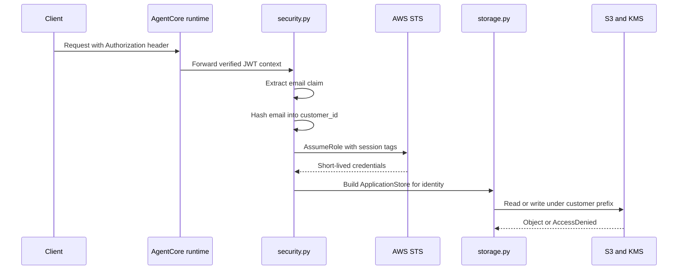

# Security and Storage Boundary

This page describes the trust boundary that constrains customer data access in FIONAA. The system derives a customer-scoped identity from verified request claims, exchanges that identity for short-lived STS credentials, and uses those credentials only to reach the customer-owned S3 prefix and matching KMS encryption context.

The important rule is that the application never accepts a caller-supplied customer identity. Identity comes from verified runtime context, storage access is limited by that derived identity, and the code that touches S3 is intentionally narrow.

## Runtime configuration supplies the storage boundary

`RuntimeSettings.from_environment()` reads the deployment settings that define the boundary:

- `FIONAA_APPLICATIONS_BUCKET`
- `FIONAA_POLICY_DOCS_BUCKET`
- `FIONAA_KMS_KEY_ARN`
- `FIONAA_DATA_ACCESS_ROLE_ARN`
- `FIONAA_CHECKPOINT_MEMORY_ID`

`required_env()` treats missing or blank values as configuration errors and raises `ValueError`. That means the app does not guess at buckets, keys, or roles; it fails closed during startup or construction when the deployment has not provided a usable boundary.

The configuration layer is intentionally explicit. `security.py` and `storage.py` can also accept injected bucket, key, and role values, but their fallback behavior is still environment-driven and still validated by `required_env()`.

## Customer identity is derived, normalized, and tag-safe

`identity_from_request_context()` reads the inbound `Authorization` bearer token from the runtime request context and decodes the JWT without verifying the signature in-process. That is deliberate: the runtime authorizer is expected to have already validated the token before the request reaches application code.

The function rejects incomplete input instead of inferring anything:

- missing `Authorization` header raises `ValueError`
- missing email claim raises `ValueError`
- the email claim is accepted from `email` or `custom:email`

`customer_id` is derived locally as `sha256(lowercased, trimmed email)`. Normalization keeps the same user mapped to the same storage prefix even when the email casing or whitespace changes, and it keeps the raw email out of session tags and object keys.

`CustomerIdentity` also validates `customer_id` and `application_id` against the STS session-tag character set before either value can be used downstream. Unsafe values fail immediately rather than being propagated into IAM tags or S3 keys.

## Scoped STS credentials are the coarse IAM boundary

`scoped_boto_session()` assumes the data-access role named by `FIONAA_DATA_ACCESS_ROLE_ARN` and wraps the returned credentials in `DeferredRefreshableCredentials`.

The STS request includes:

- a `RoleSessionName` that embeds the customer and application identifiers for traceability
- session tags for `customer_id` and `application_id`
- `TransitiveTagKeys=["customer_id"]` so the customer tag survives onward role chaining
- `DurationSeconds=3600`

This is the coarse access boundary. The runtime execution role only needs permission to assume the data-access role; it does not need direct S3 access to customer application data. If the identity or tags are wrong, the downstream role assumption or object access should fail rather than widening access.

The request path starts with verified identity, turns that into scoped credentials, and only then touches customer storage.

## S3 access is prefix-scoped to the derived identity

`ApplicationStore` is the only module that reads or writes customer application objects. It builds every key from the stored `CustomerIdentity`, never from caller input, and uses the prefix shape:

`<customer_id>/<application_id>`

JSON documents, generated results, and application PDFs all live beneath that prefix. `list_keys()` returns keys relative to the store prefix, which keeps callers inside the same identity boundary instead of exposing raw bucket paths.

Write behavior enforces the same boundary at KMS:

- `ServerSideEncryption="aws:kms"`
- `SSEKMSKeyId` from `FIONAA_KMS_KEY_ARN`
- `SSEKMSEncryptionContext` containing `{"customer_id": <derived customer id>}` encoded as base64 JSON

That encryption context is part of the security model, not decoration. It must match the KMS grant condition tied to the data-access role, so decryption depends on the same customer identity that shaped the S3 key.

## Failure handling distinguishes absence from security violations

The storage layer treats ordinary missing data differently from potentially dangerous access failures.

- missing S3 objects map to `None`
- `AccessDenied` is logged as a security-relevant event and re-raised
- other S3 errors are re-raised

A missing object is expected when a document has not been uploaded yet. `AccessDenied`, by contrast, may indicate a misconfigured tag/session or a real isolation violation. In both cases, the system fails closed and surfaces the problem.

## Shared policy documents live in a separate bucket

`PolicyDocStore` is intentionally separate from `ApplicationStore`. It reads from `FIONAA_POLICY_DOCS_BUCKET`, which contains shared, read-only policy documents rather than per-customer records. The application-data bucket remains prefix-isolated per customer and application, while the policy bucket has no customer prefix condition because its contents are meant to be shared reference material.

## What code is allowed to touch S3

The storage boundary is intentionally small:

- `ApplicationStore` handles customer application objects
- `PolicyDocStore` handles shared policy documents
- `security.py` only prepares the scoped identity and STS session used by storage

No other code path should reach customer S3 data directly. That keeps the identity boundary, the prefix boundary, and the encryption-context boundary aligned in one place.

## Invariants to preserve

1. identity is derived from verified JWT claims, not from user-supplied request data
2. `customer_id` is normalized, hashed, and safe for STS session tags
3. STS credentials carry customer and application tags and are short-lived
4. application objects stay under `<customer_id>/<application_id>/...`
5. KMS encryption context includes the same `customer_id`
6. missing objects are treated as expected absence
7. `AccessDenied` is surfaced, not hidden
8. shared policy documents are read from a separate bucket
9. required runtime settings must exist and be valid before storage access can succeed

When any of those assumptions fail, the code should fail closed.

## Focused tests

The unit tests cover the boundary conditions that matter most:

- email hashing normalizes case and whitespace
- unsafe identity and tag values are rejected
- identity is derived from the verified JWT claims
- missing authorization and missing email claim raise `ValueError`
- application S3 keys are scoped to the identity prefix
- `put_json()` writes the expected KMS encryption context
- `list_keys()` stays within the application prefix
- `PolicyDocStore` reads from the shared policy bucket
- missing required environment variables raise `ValueError`

Together, those tests confirm that identity flows from verified auth into STS scoping and then into S3 and KMS enforcement without crossing customer boundaries.
