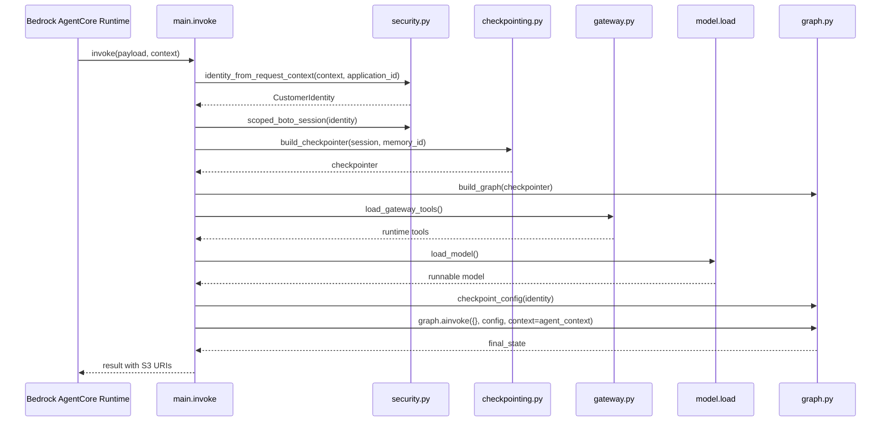
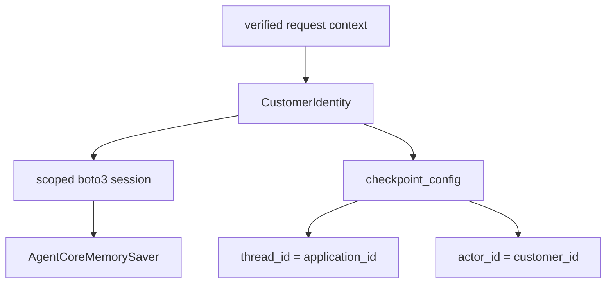
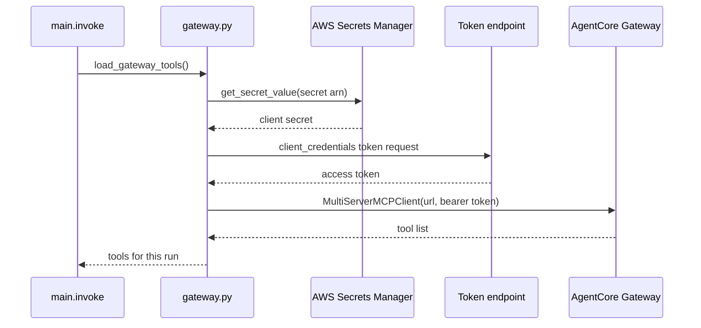

# AgentCore runtime, gateway, and checkpoint integrations

This page documents the integration boundary that connects FIONAA to the Bedrock AgentCore Runtime, the AgentCore Gateway, and Bedrock-backed checkpoint storage.
It focuses on the actual request entrypoint, what gets rebuilt for every invocation, and the configuration constraints that shape the deployed runtime.

It stays deliberately below the workflow-graph level: graph nodes, stage logic, and domain checks are covered on the graph and workflow pages.

## Runtime entrypoint and invocation flow

The deployed runtime is defined in `agentcore.json` as a single AgentCore runtime whose entrypoint is `main.py` under `app/`, with custom JWT auth and only the `Authorization` header forwarded into the container.
That means the runtime process is the only entry path for production traffic, and the app must derive all trust decisions from the verified AgentCore request context rather than from arbitrary caller payload fields.

The entrypoint itself is `invoke(payload, context)` in `fionaa/main.py`.
On each request it:

1. loads environment-driven runtime settings,
2. derives `CustomerIdentity` from the AgentCore request context and the incoming `application_id`,
3. builds a customer-scoped boto3 session,
4. creates a fresh checkpoint saver,
5. loads gateway tools,
6. loads the Bedrock model,
7. constructs `AgentContext`, and
8. invokes the LangGraph workflow with an empty initial state.

The diagram shows the integration path only; it does not expand the internal node sequence.

## What is fresh per invocation

Several collaborators are intentionally rebuilt for every runtime call rather than cached globally:

- the customer-scoped boto3 session,
- the AgentCore checkpoint saver,
- the Gateway OAuth token and MCP tool list,
- the Bedrock chat model binding,
- the `AgentContext` wrapper that holds runtime collaborators.

That lifecycle matters because this app depends on short-lived credentials and runtime-bound tool discovery.
Nothing in that set is serialized into graph state.
Instead, those collaborators are supplied to the graph through `AgentContext` for the current run only.

## Identity, session scope, and checkpointing

`security.py` resolves `CustomerIdentity` from the verified JWT forwarded by AgentCore and hashes the authenticated email into `customer_id`.
`payload["application_id"]` identifies the application being processed, but the customer boundary comes from verified runtime context, not from caller-chosen identity fields.

`scoped_boto_session(identity, role_arn=...)` assumes the data-access role with session tags for both `customer_id` and `application_id`.
That scoped session is then passed into `build_checkpointer(session, memory_id=...)` in `fionaa/integrations/checkpointing.py`, which extracts frozen credentials and instantiates `AgentCoreMemorySaver` directly.
The point of passing the session through explicitly is to avoid silently falling back to the ambient execution role.

`checkpoint_config(identity)` derives the LangGraph checkpoint namespace from the verified identity by setting `thread_id` to `application_id` and `actor_id` to `customer_id`.
That means replay and resume state are partitioned by authenticated customer/application identity, not by arbitrary caller input.

Checkpoint state is operational memory for the workflow, not the authoritative evidence record.
The persisted S3 artifacts written by the workflow remain the audit trail that downstream consumers read.

## Gateway tool loading

Gateway tools are loaded lazily in `fionaa/gateway.py` instead of at import time.
That is important because the OAuth token is short-lived and because the gateway URL, scopes, client id, and secret ARN all come from runtime configuration.
The module-level comment in `gateway.py` explicitly notes that environment variables are read at call time so test collection does not freeze placeholder values into the process.

The loading sequence is:

1. `_gateway_client_secret()` fetches the client secret from AWS Secrets Manager using `AGENTCORE_GATEWAY_CLIENT_SECRET_ARN`.
2. `_gateway_token()` performs a client-credentials token exchange using `AGENTCORE_GATEWAY_CLIENT_ID`, `AGENTCORE_GATEWAY_OAUTH_SCOPES`, and `AGENTCORE_GATEWAY_TOKEN_ENDPOINT`.
3. `load_gateway_tools()` creates a `MultiServerMCPClient` for `AGENTCORE_GATEWAY_URL` over `streamable_http`.
4. The bearer token is attached as an Authorization header and the resulting tool list is returned to `main.invoke()`.

The integration boundary here is MCP tool discovery, not workflow reasoning.
The workflow receives the tools as runtime input; it does not treat them as checkpointed state.

## Model loading and runtime guardrails

`load_model()` creates the Bedrock chat model at runtime using `ChatBedrockConverse`.
That choice is important because the workflow uses structured output and needs the Converse API path.
The runtime binding also applies the configured Bedrock retry policy, conditionally adds guardrail configuration only when both guardrail environment variables are present, and sets cache-control TTL so repeated prompts can reuse Bedrock cache points.

The model is loaded fresh for each invocation rather than persisted in graph state, so the current environment controls the exact Bedrock binding used by the run.

## Constraints imposed by the AgentCore packager and deployed runtime

`agentcore.json` constrains the deployed shape of this app in ways that affect code layout and configuration:

- `entrypoint` is `main.py`, so the runtime expects the invocation function to live in that module.
- `codeLocation` is `app/`, so production code must stay inside that package tree.
- `runtimeVersion` is `PYTHON_3_13`, so the runtime target is fixed to that interpreter.
- `authorizerType` is `CUSTOM_JWT` with a Cognito discovery URL and audience, so the app assumes JWT-based identity from the runtime context.
- `requestHeaderAllowlist` contains only `Authorization`, so other caller headers are not part of the trust boundary.
- the runtime is `PUBLIC` and `protocol` is HTTP, so inbound requests go through the Bedrock AgentCore runtime rather than a private side channel.
- the configured memory resource is `FionaaCheckpoint`, which is what checkpointing code must target unless overridden by environment.

These constraints explain why runtime wiring, gateway loading, and checkpoint creation are split across small modules instead of being hidden behind package-global singletons.
They also explain why secrets, tokens, and customer scoping are resolved at runtime rather than precomputed at build time.

## Failure boundaries and operational invariants

The integration layer assumes a few invariants that are worth preserving:

- gateway credentials are minted per invocation and not cached across runs,
- the client secret stays in Secrets Manager rather than a plain environment variable,
- checkpoint scoping comes from verified identity rather than caller input,
- runtime collaborators such as tools and the model stay outside checkpointed graph state,
- retry and circuit-breaker behavior should cover transient external failures, not configuration errors or malformed calls.

Those rules keep concurrent runs isolated and make it possible to resume after interruptions without mixing one customer's state with another's.

## Focused tests that protect this boundary

The tests that matter most for this page are the ones that pin the integration contract:

- `test_gateway_client_secret_fetched_from_secrets_manager` verifies the gateway secret is resolved from Secrets Manager.
- `test_gateway_token_uses_client_credentials_flow` verifies token minting uses the configured OAuth endpoint and scope.
- `test_load_gateway_tools_passes_bearer_token_to_mcp_client` verifies the MCP client receives the fresh bearer token and runtime URL.
- graph tests around `checkpoint_config(identity)` verify checkpoint namespaces come from verified identity.
- graph-level runtime tests that call `graph.ainvoke({}, checkpoint_config(identity), context=agent_context)` verify runtime-only collaborators are supplied through `AgentContext` and not baked into checkpoint state.

Together these tests guard the auth, scoping, and lifecycle assumptions at the runtime boundary.
