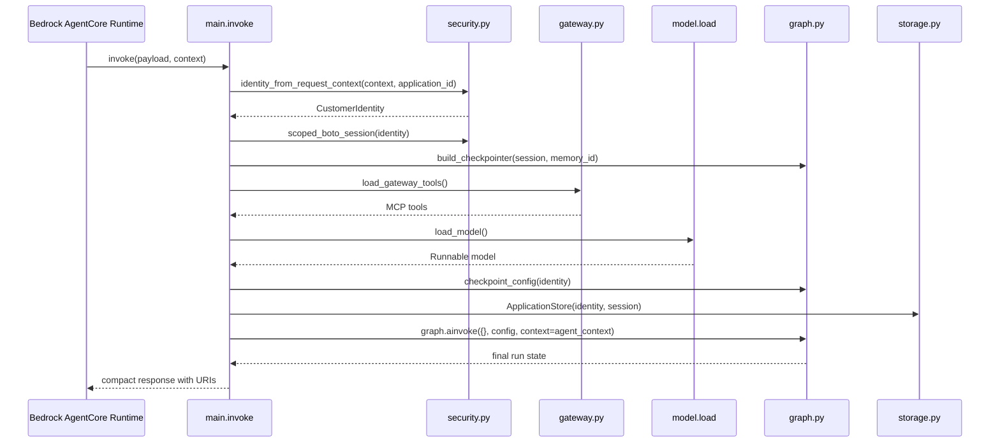
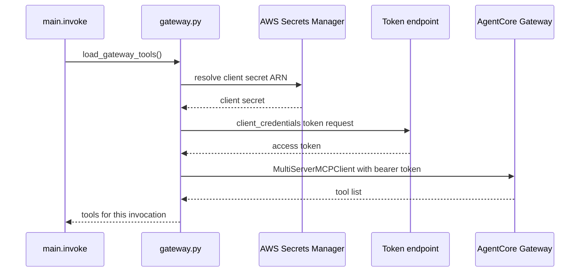

# AgentCore runtime, gateway, and model integrations

This page covers the external integration layer that connects FIONAA to Bedrock AgentCore, the MCP gateway, and Bedrock model inference.
It focuses on request entry, runtime-scoped collaborators, per-invocation tool loading, model configuration, and the failure boundaries that matter when those integrations are unavailable.

It intentionally stays at the boundary between the runtime wrapper and the workflow graph.
The node-by-node workflow, stage logic, and domain-specific checks are documented on the graph and workflow pages.

## Runtime entrypoint and request shaping

FIONAA enters through a single Bedrock AgentCore entrypoint:

```python
@app.entrypoint
async def invoke(payload, context):
```

`invoke()` is the top-level orchestration point for each request.
It derives trusted identity from the AgentCore request context, creates a customer-scoped boto3 session, builds a per-invocation checkpointer, loads gateway tools, loads the Bedrock model, constructs `AgentContext`, and then invokes the LangGraph workflow with an empty initial state.

The important control-flow rule is that identity-sensitive values come from verified runtime context, not from caller-controlled payload fields.
The payload contributes the application identifier, but authentication and tenancy scoping come from the runtime request context and the tagged STS session created from it.



This diagram shows the external integration path only.
It does not expand the internal workflow nodes.

## Runtime context versus deterministic check tools

The integration boundary uses two different kinds of collaborators, and the distinction matters for safe changes:

- **Runtime context tools** are ephemeral objects that are built for the current invocation and passed through `AgentContext`, such as the gateway tool list, the Bedrock model, the policy checker, the store, and the policy document reader.
- **Deterministic check tools** are the workflow's internal validators and pure checks that reason over already-collected evidence, rather than reaching out to external services themselves.

That distinction keeps side-effecting integrations out of the checkpointed graph state while still letting the workflow perform deterministic evaluation over captured inputs.

## Identity, session scope, and checkpointing

`security.py` resolves a `CustomerIdentity` from the verified JWT that AgentCore forwards on the request context.
`identity_from_request_context(context, application_id)` extracts the authenticated email claim, hashes it into `customer_id`, and keeps `application_id` as the opaque application identifier supplied for the run.

`scoped_boto_session(identity, role_arn=...)` then assumes the data-access role with session tags for both `customer_id` and `application_id`.
That creates the credential boundary used for S3 access, and it prevents the workflow from reaching outside the authenticated customer prefix.

The checkpointer is created from that scoped session by `build_checkpointer(session, memory_id)`.
The checkpoint namespace is derived from verified identity by `checkpoint_config(identity)`, which sets `thread_id` to the application id and `actor_id` to the customer id.
That means replay and resume state are partitioned by authenticated identity, not by caller-supplied arbitrary values.

Checkpoint state is operational memory, not the audit record.
The persisted S3 artifacts written by the workflow remain the authoritative evidence trail.

## Gateway tool loading

The AgentCore Gateway is loaded on demand from `gateway.py`.
`load_gateway_tools()` is called once per invocation, not at module import time, because the gateway OAuth token is short-lived and because the tool list must reflect the current runtime environment.

The loading path is:

1. `_gateway_client_secret()` resolves the gateway client secret from Secrets Manager using `AGENTCORE_GATEWAY_CLIENT_SECRET_ARN`.
2. `_gateway_token()` performs a client-credentials OAuth exchange using `AGENTCORE_GATEWAY_CLIENT_ID`, `AGENTCORE_GATEWAY_OAUTH_SCOPES`, and `AGENTCORE_GATEWAY_TOKEN_ENDPOINT`.
3. `load_gateway_tools()` builds a `MultiServerMCPClient` for `AGENTCORE_GATEWAY_URL` over `streamable_http` and attaches the bearer token.
4. The returned tools are threaded into `AgentContext` so graph nodes can use them as per-invocation collaborators.

This loading model is intentionally ephemeral.
It avoids caching expired authorization and keeps the tool set scoped to the run that requested it.



The gateway boundary is MCP tool loading, not workflow reasoning.
The workflow treats the returned tools as runtime input, not as state to checkpoint or persist.

## Model loading and guardrails

`load_model()` creates the Bedrock chat model at runtime using `ChatBedrockConverse`.
That choice matters because the workflow uses structured output, and the Converse API supports the response format path that the legacy invoke-model wrapper does not.

The model configuration has three important behaviors:

- it always applies the Bedrock retry policy defined in `BEDROCK_RETRY_CONFIG`, which uses adaptive retries for transient Bedrock throttling and capacity errors,
- it only adds guardrail configuration when both `FIONAA_GUARDRAIL_ID` and `FIONAA_GUARDRAIL_VERSION` are present, and
- it binds a one-hour cache-control TTL so repeated node prompts can reuse Bedrock cache points across runs.

The lazy guardrail lookup keeps local runs and tests working when those variables are absent.
The model is loaded at runtime rather than serialized into graph state, so each invocation receives a fresh model binding with the current environment settings.

## Retry and circuit-breaker behavior at the integration boundary

Integration reliability is split across two layers:

- the model client uses Bedrock adaptive retries for transient Converse-level errors,
- the workflow resilience helpers add retry and circuit-breaker behavior around whole `agent.ainvoke()` calls that cross external boundaries.

That division is important because the model retry policy only sees one model request at a time, while the workflow-level resilience wrapper can cover a larger unit of work that may include multiple model calls and gateway tool calls.

`workflow/resilience.py` treats timeouts, connection failures, and selected Bedrock `ClientError` codes as retryable.
It opens a per-dependency circuit after repeated failures, short-circuits further calls while the circuit is open, and later allows a half-open probe after the reset timeout.
The result is that a sustained external outage degrades to the node's own fallback instead of letting every request spend its full retry budget hammering the same dependency.

## Failure modes and invariants

The integrations assume a few invariants that should not be weakened casually:

- gateway credentials are short-lived and must be minted per invocation,
- the gateway client secret stays in Secrets Manager, not in a plain environment variable,
- checkpoint scoping comes from verified identity, not caller-supplied input,
- runtime collaborators such as tools and the model stay outside checkpointed graph state, and
- retry and circuit-breaker behavior should only cover transient external failures, not caller or configuration mistakes.

Those constraints are what keep the runtime safe to operate under concurrent load and safe to resume after interruptions.

## Focused tests that matter

The tests that protect this integration boundary are the ones that verify the runtime wiring and the external contract assumptions:

- `test_gateway_client_secret_fetched_from_secrets_manager` verifies that the gateway secret is resolved from Secrets Manager.
- `test_gateway_token_uses_client_credentials_flow` verifies the token request uses the configured OAuth endpoint and scope.
- `test_load_gateway_tools_passes_bearer_token_to_mcp_client` checks that fresh bearer tokens are passed into the MCP client configuration.
- graph tests around `checkpoint_config(identity)` verify that checkpoint namespaces are derived from verified identity.
- workflow tests around the full graph wiring verify that runtime-only collaborators can be supplied through `AgentContext` without becoming part of checkpointed state.

These tests collectively guard the integration layer's auth, scoping, and lifecycle assumptions.
