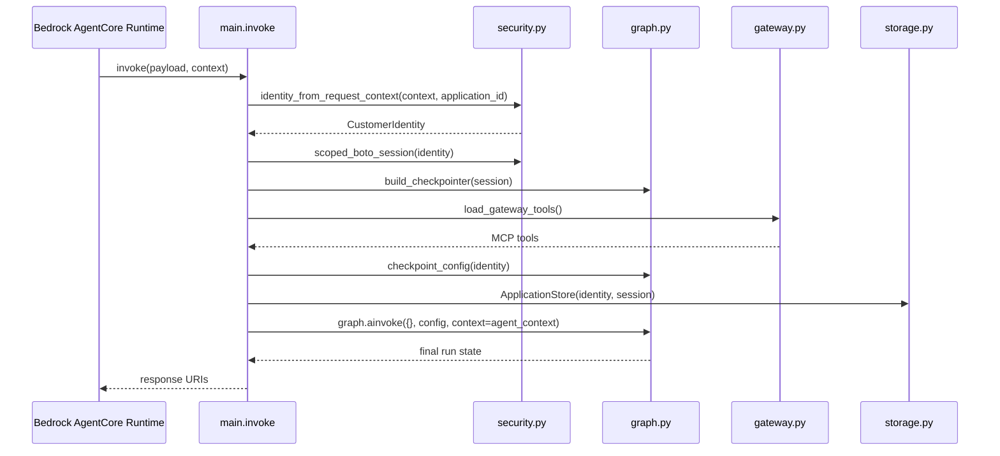
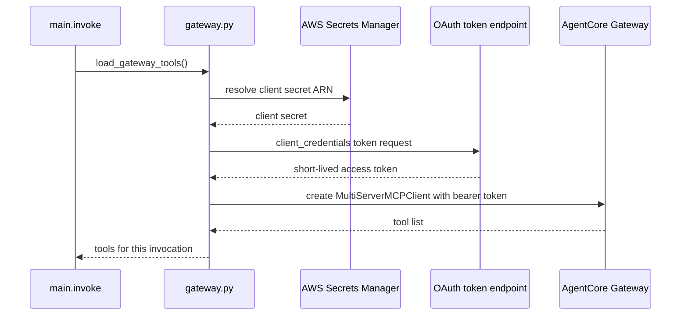

# AgentCore runtime and gateway integrations

This page describes the external AgentCore services that FIONAA depends on:

- the Bedrock AgentCore runtime entrypoint that starts each run,
- the AgentCore Memory checkpointer used for resumable LangGraph state, and
- the AgentCore Gateway used to expose MCP tools for Companies House, web search, and location lookups.

It stays at the integration boundary. The internal node-by-node graph behavior is documented on the workflow page, not repeated here.

## Runtime invocation shape

`main.py` registers a single AgentCore entrypoint:

```python
@app.entrypoint
async def invoke(payload, context):
```

The entrypoint is the top-level control point for every request. It derives trusted identity from the runtime request context, builds a customer-scoped boto3 session, creates the checkpointer, loads gateway tools, constructs `AgentContext`, and then starts the graph with `graph.ainvoke({}, config, context=agent_context)`.

The call shape matters:

- the initial LangGraph state is empty (`{}`),
- identity-sensitive values are derived from the verified runtime context, not accepted from the payload as authority, and
- the runtime context carries ephemeral collaborators such as the store, policy docs, and tools.

After the graph finishes, `invoke` returns a compact response with `application_id` plus S3 URIs for the primary evidence artifacts.



The diagram shows the runtime wiring only. It does not expand the internal graph workflow.

## Checkpoint memory usage

The graph uses `build_checkpointer(session)` to create an `AgentCoreMemorySaver` from the customer-scoped boto3 session.

Key properties of this design:

- the saver is built per invocation, not at module import time,
- the AWS credentials passed into the saver come from the scoped session, and
- checkpoint scoping is derived from verified identity via `checkpoint_config(identity)`.

`checkpoint_config(identity)` returns the LangGraph checkpoint namespace:

- `thread_id` is the application identifier,
- `actor_id` is the customer identifier.

That keeps replay and resume state partitioned by authenticated customer rather than by caller-controlled input.

The page should be read with one important distinction in mind: checkpoint memory is operational state. It supports pause, resume, and replay of the graph, but it is not the authoritative evidence record. The persisted S3 artifacts written by the nodes remain the audit trail.

## Why the gateway tools are fetched per invocation

`gateway.py` loads MCP tools through `load_gateway_tools()`, and `main.py` calls it once per invocation.

That is intentional for two reasons:

1. the OAuth access token used for the gateway is short-lived, and
2. tool loading depends on the current runtime environment, so caching tools at module load would risk stale auth or stale configuration.

The loading path is:

1. `_gateway_client_secret()` reads `AGENTCORE_GATEWAY_CLIENT_SECRET_ARN` and resolves the secret from Secrets Manager.
2. `_gateway_token()` performs the Cognito client-credentials flow using `AGENTCORE_GATEWAY_CLIENT_ID`, `AGENTCORE_GATEWAY_OAUTH_SCOPES`, and `AGENTCORE_GATEWAY_TOKEN_ENDPOINT`.
3. `load_gateway_tools()` constructs a `MultiServerMCPClient` for `AGENTCORE_GATEWAY_URL` and attaches the bearer token.
4. The returned tools are passed into `AgentContext`, where graph nodes can receive them through runtime context.

Because the token is minted fresh each time, the graph avoids reusing expired authorization across requests. That also keeps the tool list aligned with the invocation that asked for it.



The boundary here is MCP/tool loading, not graph reasoning. The graph treats the returned tools as ephemeral runtime input.

## MCP loading boundary and safe-change assumptions

The gateway integration assumes a few things that matter when changing the code safely:

- The Gateway is accessed through MCP over `streamable_http`.
- The tools are loaded from the Gateway on demand, not bundled into the application image.
- The bearer token is short-lived and should be considered per-invocation state.
- The secret used to mint that token is stored in Secrets Manager, not in a plain environment variable.
- Environment variables are read at call time, not module import time, so test setup and runtime configuration can differ safely.

That last point is subtle but important. `gateway.py` intentionally avoids binding `os.environ[...]` at import time because the module is imported during test collection before some environment fixtures are loaded. Reading configuration inside the functions keeps the runtime and test boundaries predictable.

If you change the gateway surface, keep the following invariants intact:

- do not cache the token across invocations,
- do not move the client secret into an unprotected env var,
- do not accept caller-supplied identity for checkpoint scoping, and
- do not make the checkpointer or MCP client part of checkpointed graph state.

## Relationship to graph context

The graph code consumes these integrations through `AgentContext`.

- `store` and `policy_docs` are runtime collaborators for application data and policy text.
- `tools` is the per-invocation MCP tool list from the gateway.
- `checkpointer` is passed separately to graph compilation so resumable state stays outside the runtime context object.

That split matters because runtime collaborators often wrap live clients and non-serializable objects, while checkpointed state must remain resumable and serializable.

In practice, this means the integration layer is responsible for constructing the right collaborators once per invocation and handing them into the graph in the right place.

## Focused tests that guard the integration

The most important tests are the ones that verify the integration boundary rather than internal node logic:

- `test_checkpoint_config_derives_from_identity` ensures checkpoint namespaces come from verified identity.
- `test_build_graph_checkpoints_successfully_with_deps_in_context` proves runtime-only collaborators can stay out of checkpointed state.
- `test_check_companies_house_calls_gateway_and_persists` and related tests show gateway tools are passed into the graph through context.
- `test_check_against_policy_scopes_check_tools_by_loan_type` and `test_build_graph_runs_all_nodes_in_order` demonstrate that tool surfaces are selected per invocation and then consumed by the graph.

Those tests protect the security and lifecycle assumptions behind the integrations, especially the short-lived auth token and the checkpointing boundary.
