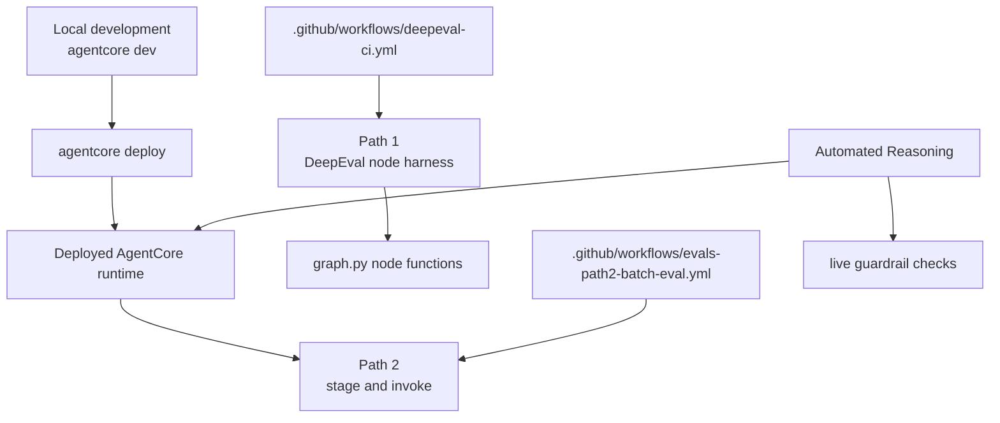
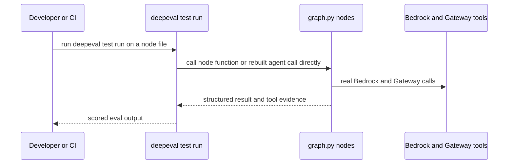
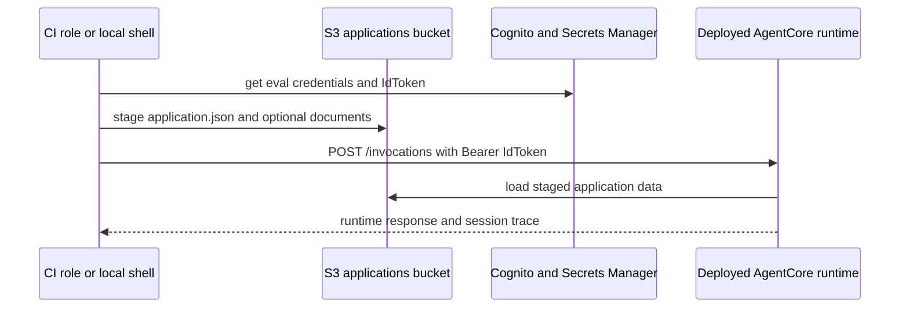
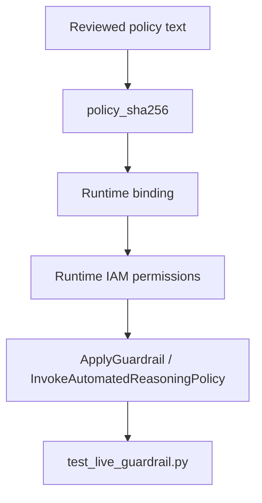

# Deployment and Evaluation Operations

This page ties together the deployable runtime, the evaluation runners, and the CI workflows that check them before production behavior changes.

At a practical level, maintainers need to know four things:

- how to run the app locally with `agentcore dev` and publish it with `agentcore deploy`;
- how Path 1 node evals exercise `graph.py` logic directly with DeepEval;
- how Path 2 stages full applications and invokes the deployed runtime;
- how Automated Reasoning policies are deployed, smoke-tested, and recorded.



## What is deployed

The deployable unit is the `fionaa` AgentCore project under `fionaa/agentcore/`. `agentcore dev`, `agentcore deploy`, and `agentcore invoke` all rely on the configuration stored there, while the application code lives under `fionaa/app/`.

The runtime behavior described on this page is the deployed AgentCore artifact, not the local node harness. The runtime consumes staged application data from S3, uses the deployed graph, and is governed by the runtime's IAM and auth configuration. Deployment checks therefore need to confirm both packaging and runtime permissions, not just Python correctness.

The application README also records the local entrypoint and deployment commands: `agentcore dev` starts a local server on `0.0.0.0:8080`, and `agentcore deploy` publishes the project into Bedrock AgentCore.

## Local development and deployment

Use the app repository for local development work:

```bash
cd fionaa/app
source .venv/bin/activate
agentcore dev
```

From another terminal, you can invoke the local server with `agentcore invoke --dev "What can you do"`.

For deployment, run the AgentCore CLI from `fionaa/agentcore` with the configured AWS profile. The existing docs show the normal flow as:

```bash
export AWS_PROFILE=AIOps
agentcore deploy --diff -y
agentcore deploy -y
agentcore dataset publish-version --name fionaa_eval_dataset
```

Two operational details matter when planning changes:

- `agentcore deploy` repackages the runtime artifact even when the app code is unchanged, so a deploy can update the live runtime as a side effect.
- the CDK app under `fionaa/agentcore/cdk/` must have its lockfile-pinned dependencies installed before deployment; otherwise synth/deploy can fail before any runtime change is applied.

## Path 1: node-level DeepEval harness

Path 1 is the PR-time DeepEval harness for the node logic. It answers a narrow question: did direct node behavior change when the graph functions were called without the deployed runtime?

The harness is intentionally distinct from AgentCore's native `ThirdParty.DeepEval.*` evaluators. Those AWS-native evaluators run against deployed-runtime sessions and belong to the batch-evaluation side of the system. Path 1 instead uses the pip `deepeval` package with custom metrics and custom scenario runners.

The runnable node files use the shared dataset in `fionaa/evals/datasets/fionaa_eval_dataset.jsonl` and follow two implementation patterns:

- `test_companies_house.py` and `test_web_search.py` rebuild the agent call so `ToolMessage`s remain visible for scoring.
- `test_policy_check.py` calls `check_against_policy` directly and scores evidence written to the node store.

Path 1 proves that the direct node logic, prompt shaping, and tool routing still work. It does **not** prove that the deployed runtime, JWT auth, S3 staging, or runtime-specific IAM configuration still work.



This is the fast feedback loop for node regressions.

### Path 1 failure modes and assumptions

Path 1 still makes real AWS calls. It depends on working Bedrock and Gateway access, so it is not a fully mocked unit-test path.

Important operational assumptions:

- the workflow obtains AWS access through GitHub OIDC, not static keys;
- the job writes Gateway OAuth values into `fionaa/agentcore/.env.local` and relies on the runtime helper code to read that file;
- the job runs the DeepEval files one at a time because Bedrock quota is shared at the account level;
- the job is advisory, not blocking, because LLM-judge scores can be noisy and transient network issues can happen.

That means a failed Path 1 run can indicate a real regression, a judge fluctuation, a Gateway or Bedrock interruption, or a quota-related throttle. It should be treated as a strong signal, but not as proof that the deployed runtime is broken.

## Path 2: stage and invoke the deployed runtime

Path 2 validates the deployed runtime itself. It answers a different question: does the published artifact behave correctly when it receives staged application data the way production expects?

The Path 2 runner lives at `fionaa/evals/runtime/eval_path2_stage_and_invoke.py`. It filters the dataset down to full-application scenarios, writes each scenario's `application` JSON into a disposable S3 prefix, optionally stages supporting documents under the runtime's expected input keys, gets an ID token for a disposable Cognito eval user, and sends a direct HTTPS POST to the runtime `/invocations` endpoint with the bearer token and runtime session header.

The need for Path 2 comes from the runtime contract itself: the real entrypoint expects `{"application_id": ...}` plus a verified JWT, then loads application data from S3. It is not a chat-message endpoint, so Path 1's dataset-style payloads cannot drive it directly.



This is the higher-fidelity path and the one that matches deployed behavior.

### Path 2 failure modes and assumptions

Path 2 has stronger environment requirements than Path 1:

- the runtime must already be deployed;
- the disposable eval identity must exist and be able to mint an ID token;
- the CI or local identity must have narrow S3 write access to stage data;
- the runtime authorizer must accept the JWT `IdToken` and the `email` claim it carries;
- scenarios must be complete enough to exercise the full graph, not just one node.

The script is sequential by design. Concurrent runtime invocations share the same Bedrock quota and can throttle each other, so parallelizing Path 2 is a known failure mode.

Another important boundary is permissions: the staging role writes directly to S3 with its own narrow grant. It does **not** assume the runtime's data-access role, and it should not need broad shared permissions.

Path 2 proves deployed-runtime behavior, S3 staging, and auth/session wiring. It does **not** prove the independent correctness of the deployed policy resources or the quality of the dataset's labels and ground truth.

## Automated Reasoning resources

Automated Reasoning is used as a separate policy-consistency capability. In this repository it has two related operational surfaces:

1. the deployed runtime policy configuration under `fionaa/agentcore/automated-reasoning/`;
2. standalone smoke tests in `fionaa/evals/automated_reasoning/`.

The runtime configuration includes versioned policies, guardrails, bindings, and IAM permissions. The deployment notes say these resources are separate from the PII-redaction guardrail and that the runtime role must have scoped `bedrock:ApplyGuardrail` and `bedrock:InvokeAutomatedReasoningPolicy` permissions. The deployment assertion also records the exact reviewed policy text through a digest.

The standalone smoke runners use synthetic facts only. They charge real `ApplyGuardrail` requests and verify the live checker against boundary cases, but they do **not** deploy anything and they do **not** replace full application evaluation. The companion runtime evaluation notes also record that the deployed smoke test only demonstrates that the runtime enforced the policy path and returned a fail-closed result; it does not prove an approval path.



This shows the dependency chain for deployed policy consistency checks.

### Automated Reasoning failure modes and assumptions

Key operational assumptions:

- the runtime role must already be wired to the reviewed policy version and guardrail version;
- the digest must match the exact reviewed policy text used at deployment time;
- cross-region guardrail permissions must be present where required;
- standalone smoke tests require AWS credentials and make billable calls.

Important failure modes:

- a missing or mismatched binding causes applications reaching policy validation to be referred or fail closed rather than silently approved;
- a policy-version mismatch is not the same thing as a policy contradiction, so it should not be interpreted as an invalid result;
- a live smoke test can show permission or configuration failure even when the application graph itself is correct.

## CI workflows and what they prove

`.github/workflows/deepeval-ci.yml` is the PR-time Path 1 workflow. It uses GitHub OIDC to assume a narrowly scoped AWS role, writes only Gateway OAuth configuration into `.env.local`, installs dependencies, and runs each DeepEval file sequentially. It is explicitly advisory: failures are surfaced as warnings rather than merge blockers.

That workflow proves the node harness still runs in CI with real AWS dependencies and that the PR change did not obviously break node-level scoring. It does **not** validate the deployed runtime artifact.

`.github/workflows/evals-path2-batch-eval.yml` is the post-deploy Path 2 workflow. It is a gating workflow on `master`, uses a separate OIDC role, installs the AgentCore CLI and project dependencies, deploys the `fionaa` project, stages the full-application inputs, invokes the deployed runtime, builds ground truth, and then runs batch evaluation followed by a gate check.

That workflow proves the deployed artifact can be staged, invoked, and scored end to end. It does **not** prove that every possible scenario is safe, nor does it prove that a green batch result means the system is ready for every future change.

Important deployment and workflow assumptions:

- `agentcore deploy` and `agentcore run` must be run from the project root.
- the batch-evaluation path uses `--json` output and a separate polling loop because the CLI wait path can hang on terminal statuses;
- Path 2 jobs are queued rather than canceled so an in-flight deploy or batch evaluation is not interrupted.

A failed Path 2 workflow can mean a packaging issue, a deployment problem, a runtime regression, a permission problem, or a batch-evaluation scoring failure. It should be treated as a production-facing gate, not as a node-unit-test replacement.

## Which check answers which question?

Use this rule of thumb:

- **Path 1** answers: "Did direct node behavior, tool routing, or prompt logic change?"
- **Path 2** answers: "Does the deployed runtime still work with staged inputs, auth, and S3-backed execution?"
- **Automated Reasoning smoke tests** answer: "Do the live policy resources and guardrails still respond to boundary cases and enforce the reviewed policy path?"

If you need a local, fast check, choose Path 1.
If you need a deployed-runtime gate, choose Path 2.
If you need to confirm policy-resource wiring and live guardrail behavior, use the Automated Reasoning smoke tests.

These checks are complementary. None of them alone proves the entire system is correct.
