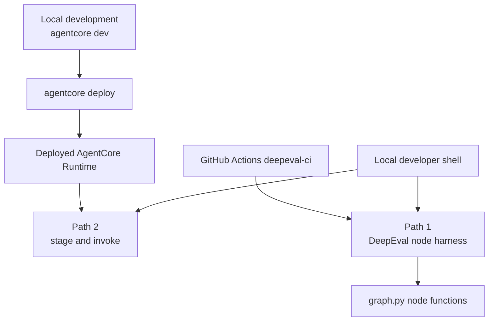
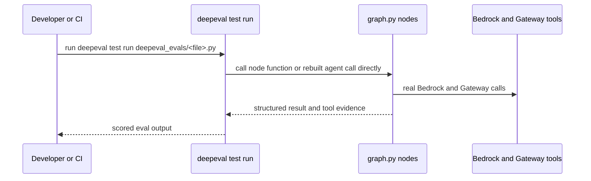
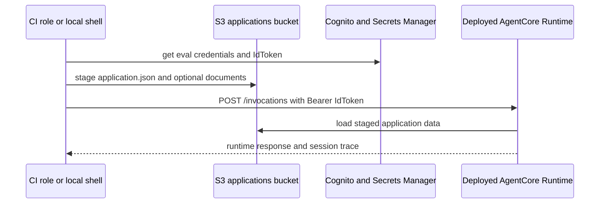

# Deployment, batch evaluation, and eval harnesses

This page is the shortest path to choosing the right execution mode for `fionaa`:

- **Local development** runs the agent with `agentcore dev`.
- **Deployment** publishes the project to AWS with `agentcore deploy`.
- **Path 1** is the PR-time DeepEval harness in `fionaa/agentcore/deepeval_evals/`; it calls node functions directly.
- **Path 2** stages inputs and invokes the **deployed runtime**; it is the higher-fidelity post-deploy path.

## At a glance

This shows the split between direct node evaluation and deployed-runtime evaluation.

## What is deployed

`fionaa/README.md` describes the AgentCore project layout and the basic operational commands. The deployed unit is the AgentCore project defined under `fionaa/agentcore/`, including the runtime, dataset, and evaluator resources.

In AWS, the repository uses AgentCore resources configured through `agentcore.json` and deployed with the AgentCore CLI. The same CLI also supports `agentcore status`, `agentcore invoke`, `agentcore eval`, and `agentcore deploy` for inspecting and operating the project.

The CI infrastructure for eval gating is separate from the AgentCore-managed stack: the repository keeps a small `ci-infra/` CDK app for GitHub OIDC and CI permissions rather than folding that logic into the runtime deployment. That boundary matters because CI needs its own narrow AWS role and should not inherit the runtime's data-access trust.

## Path 1: node-level DeepEval harness

Path 1 is the harness under `fionaa/agentcore/deepeval_evals/`.
It is designed to answer: **do the node functions still behave correctly when called directly?**

The harness is not the same thing as AgentCore's native `ThirdParty.DeepEval.*` evaluators. Those AWS-native evaluators run against a real deployed-runtime session and belong to the batch-evaluation side of the world. Path 1 instead uses the actual `deepeval` Python package with custom metrics.

The three runnable test files currently follow this pattern:

- `test_companies_house.py` rebuilds the agent call for `check_companies_house`, then reads the returned `ToolMessage`s so it can verify the expected tool trajectory.
- `test_policy_check.py` calls `check_against_policy` directly and reads the tool-call evidence from the node's store writes.
- `test_web_search.py` rebuilds the agent call for `search_web` so it can keep tool-call evidence visible for scoring.

All three use the dataset in `fionaa/agentcore/datasets/fionaa_eval_dataset.jsonl` and score with a mix of `GEval`-style metrics, deterministic tool-prefix checks, and an injection-resistance metric.

This is the fast, PR-time feedback loop.

### Important Path 1 invariants

- It runs **against node functions directly**, not against the deployed runtime.
- It is useful when you want to catch prompt, tool-routing, or node-logic regressions quickly.
- It is intentionally advisory in CI because LLM-judge scoring can be noisy.
- It depends on real Bedrock and real Gateway access, so it still exercises external services.
- It serializes scenarios within a file to reduce Bedrock throttling, and the CI job runs the files one at a time for the same reason.

## Path 2: stage and invoke the deployed runtime

Path 2 is the script `fionaa/agentcore/eval_path2_stage_and_invoke.py`.
It answers a different question: **does the deployed runtime behave correctly when it is fed staged application data and invoked the way production uses it?**

This path exists because `fionaa`'s real entrypoint does **not** accept a chat message. It expects `{"application_id": ...}` plus a verified JWT, then loads `input/application.json` from S3. That means the dataset-style payload used by Path 1 cannot drive the runtime directly.

Path 2 therefore stages each scenario's `application` JSON under a disposable `customer_id/application_id` prefix, optionally stages documents under the exact `input/annual_accounts_<n>.json` and `input/bank_statement_<n>.json` prefixes the runtime looks for, fetches an ID token for the disposable eval user, and then POSTs directly to the runtime `/invocations` endpoint with `Authorization: Bearer <id_token>` and the runtime session-id header.

The script is sequential on purpose: concurrent invocations share the same Bedrock quota and can throttle each other.

This is the higher-fidelity path and the one that matches deployed behavior.

### Important Path 2 invariants

- It runs **against the deployed runtime**, not against node functions directly.
- It needs the runtime to be deployed and a real eval identity to be provisioned.
- It uses direct S3 writes with the CI role's own narrow permissions, not the runtime's data-access role.
- It must use the JWT `IdToken`, because the runtime authorizer and `security.py` need the `email` claim.
- It only makes sense for scenarios whose `application` is complete enough to run the whole graph.

## CI behavior and permissions

The GitHub Actions workflow `.github/workflows/deepeval-ci.yml` is the PR-time Path 1 runner.
It is configured as advisory, not blocking:

- it triggers on changes to the application code, eval harness, dataset, and the workflow itself;
- it assumes an AWS role via GitHub OIDC;
- it writes only a small `.env.local` file for Gateway OAuth configuration;
- it installs the app dependencies and then runs each DeepEval file sequentially;
- it marks failures as warnings rather than as merge blockers.

The workflow also documents two operational boundaries that matter:

1. The AWS access comes from GitHub OIDC, not from static AWS keys in the repository.
2. Bedrock quota is shared at the account level, so running eval files in parallel is a known failure mode.

The CI infrastructure for this auth and permissions setup lives in `/ci-infra`, which is separate from the runtime stack under `fionaa/agentcore/cdk/`.
That separation keeps CI permissions narrow and avoids coupling eval-gating policy to the runtime deployment itself.

## Which path should I use?

Use **Path 1** when you want quick feedback on node logic, tool routing, prompt changes, or dataset regressions.
It is the right choice for local iteration and PR checks.

Use **Path 2** when you need to validate the deployed artifact and the full runtime path, including S3 staging, JWT auth, and runtime invocation semantics.
It is the right choice after deployment, or when you need production-faithful behavior rather than direct-node behavior.

## Operational notes

- `agentcore deploy` publishes the project to AWS; `agentcore status` shows what is live.
- `agentcore dev` is the local development loop.
- `agentcore eval` and native AgentCore batch-evaluation flows belong to the deployed-runtime side, not the direct-node DeepEval harness.
- Path 1 currently uses real Bedrock and Gateway services but remains a direct harness, so it can surface issues that would not appear in a fully mocked unit test.
- Path 2 is intentionally more expensive and more coupled to AWS state, so keep it for post-deploy validation and full-fidelity gates.

If you only need to decide where a new eval belongs, the rule of thumb is simple: **direct node logic belongs in Path 1; deployed-runtime behavior belongs in Path 2**.
