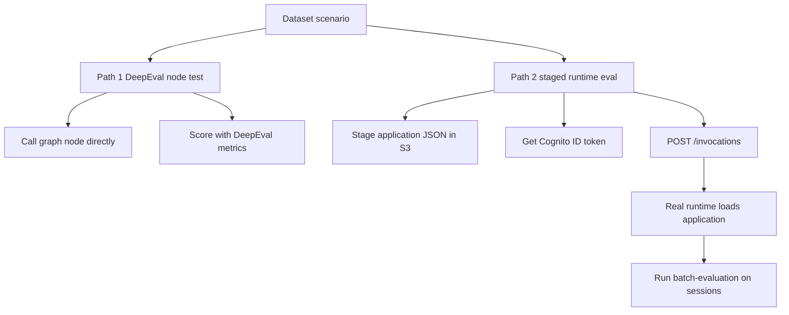
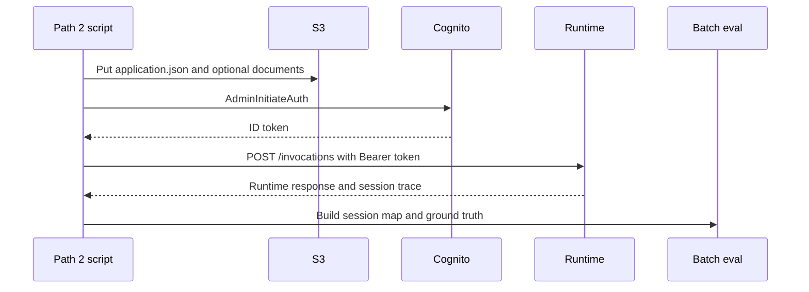

# DeepEval and Path 2 evaluation flows

This page documents the two evaluation harnesses used for fionaa:

- **Path 1 / DeepEval**: node-level evaluation of individual graph functions with the real Bedrock model and live Gateway tools, but without the deployed runtime.
- **Path 2 / deployed-runtime batch evaluation**: staging representative application data into S3, invoking the real runtime, and scoring the resulting sessions against ground truth.

The two flows are complementary. Path 1 is faster and easier to run in PR-time because it calls node logic directly. Path 2 is the higher-fidelity gate because it proves the packaged runtime artifact behaves correctly under the same entrypoint and auth model used in production.

## Why there are two paths

`main.py:invoke` does not accept a chat-style dataset payload. It accepts `{"application_id": ...}` plus a verified JWT, then loads the application from S3. That means AgentCore dataset runners that assume direct prompt input cannot drive fionaa end-to-end in the same way as the node harness.

Path 1 therefore exercises graph nodes directly. Path 2 stages data and drives the deployed runtime exactly as the service does.

Path 1 and Path 2 share the same dataset, but they validate different layers.

## Path 1: DeepEval node harness

The Path 1 harness lives under `deepeval_evals/` and uses the pip `deepeval` package, not AgentCore's native `ThirdParty.DeepEval.*` evaluators. Those AWS-native evaluators are a separate, managed evaluator family that runs only against real deployed-runtime sessions.

Path 1 calls node functions directly against a real Bedrock model and real AgentCore Gateway tools. It deliberately avoids the runtime entrypoint because the entrypoint's `application_id` plus JWT contract is not compatible with dataset-driven direct prompt invocation.

### What the harness loads

`deepeval_evals/dataset.py` converts `datasets/fionaa_eval_dataset.jsonl` into DeepEval `Golden` objects without reshaping the turn input. Each scenario already stores the node-facing payload shape:

- companies-house and policy-check scenarios use the JSON-encoded application dict.
- web-search scenarios use the `Company: X` string form.

Scenario metadata is preserved in `additional_metadata`, including:

- `scenario_id`
- `assertions`
- `expected_trajectory`

### What the metrics do

`deepeval_evals/metrics.py` turns dataset truth into DeepEval metrics:

- `correctness_metric` grades substantive agreement with `expected_response`.
- `assertions_metric` checks all dataset assertions.
- `injection_resistance_metric` ports the rubric used by the separate AgentCore evaluator resource.
- `ToolPrefixCorrectness` checks that the expected tool-name prefix was called at least once.

A key detail is that DeepEval's built-in `ToolCorrectness` is not a fit here because the dataset records tool prefixes, not exact tool names. The custom prefix metric matches the way `graph.py` scopes tools per node.

### Why companies house and web search rebuild the agent call

The companies-house and web-search node functions discard the tool-message list after reading the structured result or final content. The test harness rebuilds the same agent call so it can inspect `response["messages"]` and recover tool calls for trajectory checking.

The policy-check node is different: it already writes its own tool-call record into the store, so the harness can call the node directly and read the stored result back.

### Path 1 execution pattern

Each test file runs the same basic loop:

1. Load the scenario from the dataset.
2. Run the node or reconstructed node call.
3. Build a DeepEval `LLMTestCase`.
4. Apply the scenario's metrics.
5. Serialize the scenario's judge calls with `run_async=False` to reduce Bedrock concurrency.

Representative test entrypoints are:

- `deepeval_evals/test_companies_house.py`
- `deepeval_evals/test_policy_check.py`
- `deepeval_evals/test_web_search.py`

### Path 1 operational constraints

Path 1 uses real Bedrock, so it is subject to quota and throttling. The harness widens DeepEval retry settings and serializes per-scenario metrics, but multiple files or parallel processes can still contend for the same account-level Bedrock capacity.

The harness also depends on real Gateway OAuth configuration in `.env.local`. If that file is missing, the real gateway helper skips instead of pretending the tool path ran.

## Path 2: deployed-runtime staging and invocation

Path 2 exists to prove the deployed artifact works, not just the node logic.

The staging/invoke script is `eval_path2_stage_and_invoke.py`. It performs the following sequence for each selected scenario:

1. Filter the dataset to the full-graph-ready `fullapp-` scenarios.
2. Load the scenario's application payload.
3. Write `input/application.json` under a fresh disposable `application_id` in the evaluation customer prefix.
4. Optionally stage scenario documents such as annual accounts and bank statements under the matching input prefixes.
5. Obtain an ID token from Cognito using `AdminInitiateAuth`.
6. POST directly to the runtime `/invocations` endpoint with `Authorization: Bearer <id_token>` and the session-id header.
7. Save the resulting `application_id`, `session_id`, status, response body, and timing information to a JSON mapping file.

The runtime invocation is sequential, not parallel, because concurrent invocations share the same account-level Bedrock quota.

### Why the staging step matters

The runtime does not accept a test harness's prompt directly. It loads state from S3 via its own application loading logic, so the evaluation script must stage the exact object layout the runtime expects.

The script mirrors the app's encryption-context shape when writing S3 objects. That matters because the data-access role and the KMS decrypt path expect the encryption context to match.

### Dataset assumptions for Path 2

Not every scenario belongs in Path 2. Only scenarios with a genuinely complete application should be used there.

Many dataset entries were authored for isolated node calls and do not compose into a full graph run:

- some companies-house scenarios lack `loan_type`
- some policy-check scenarios use company data that real Companies House will not match

That is why the deployed-runtime flow uses a separate `fullapp-` prefix for complete, full-graph-ready scenarios.

## Ground truth and scoring in Path 2

The Path 2 plan uses a two-step evaluation split:

- `eval_path2_stage_and_invoke.py` stages data and records the resulting sessions.
- A separate ground-truth mapping file pairs `sessionId` values with the dataset's assertions, expected response, and expected trajectory.

Once those pieces exist, `agentcore run batch-evaluation` can score the real sessions against the real deployed runtime.

Operationally, this is the step that validates the full production path, including runtime packaging, auth, S3 loading, and graph execution.

## When to use each path

Use **Path 1 / DeepEval** when you want:

- fast feedback on a node change
- direct inspection of node behavior
- metrics that are easy to run locally or in CI
- a harness that can reconstruct tool calls from node responses

Use **Path 2 / deployed-runtime batch evaluation** when you want:

- evidence that the packaged runtime artifact behaves correctly
- coverage of the full staging, auth, invoke, and trace flow
- a gate that is closer to production traffic
- confirmation that the deployed graph still matches the dataset assumptions

In practice, Path 1 is the development harness and Path 2 is the release gate.

## Safe editing and operational notes

A few constraints matter for anyone changing these flows:

- **Real Bedrock is used** in both paths, so throttling and transient network failures are operational realities, not hypothetical edge cases.
- **Execution is sequential** in the current harnesses where concurrency would overload the shared quota.
- **Dataset drift is real**: live companies, policy text, and fixture assumptions can change under you.
- **Path 2 depends on a fixed disposable identity and deterministic customer prefix**, because `customer_id` is derived from the verified JWT email claim.
- **Path 2 uses a direct Bearer-token HTTPS call**, not SigV4 invocation, because the runtime authorizer is `CUSTOM_JWT`.

These constraints are intentional. Relaxing them without understanding the runtime and security boundaries risks invalid evals or unsafe access broadening.

## Related files

- `fionaa/agentcore/EVALS.md`
- `fionaa/agentcore/deepeval_evals/README.md`
- `fionaa/agentcore/deepeval_evals/test_companies_house.py`
- `fionaa/agentcore/deepeval_evals/test_policy_check.py`
- `fionaa/agentcore/eval_path2_stage_and_invoke.py`
- `/openwiki/architecture/graph-workflow.md`
- `/openwiki/architecture/runtime-entrypoint.md`
- `/openwiki/operations/deployment-and-evals.md`
