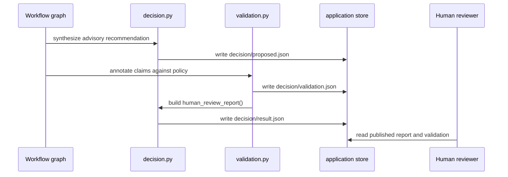

# Human-review publication and validation workflow

This workflow turns the graph’s assessed inputs into a published report for a human reviewer. It has two distinct outputs:

1. an **advisory recommendation** synthesized from the upstream assessment stages
2. a **review-ready publication** that keeps the recommendation visible, adds claim-level validation annotations, and always ends with `outcome: pending_human_review`

The key design rule is separation of concerns: validation annotates claims, but it does not change the human-review outcome.

## What the decision stage publishes

The decision pipeline has three important shapes of output:

- `decision/proposed.json` — the AI recommendation plus the upstream assessment inputs that produced it
- `decision/validation.json` — claim-level policy-consistency annotations and status accounting
- `decision/result.json` — the final human-review report that callers should treat as the published decision object

The recommendation is advisory. The published report is reviewer-facing and explicitly distinguishes the model’s suggested outcome from the final required human action.

`human_review_report()` performs that transformation by removing the recommendation’s `outcome`, `reason`, and `rationale` from the top level, storing them under `ai_recommendation`, and forcing the report’s `outcome` to `pending_human_review`. If validation is available, it is attached as a sibling field in the same report.

This shows the publication sequence from recommendation to reviewer-facing artifact.

## Recommendation versus published decision

The workflow keeps the recommendation and the final published decision separate on purpose.

`fionaa/workflow/decision.py` builds the advisory decision in `synthesize_decision()`. It gathers the upstream outputs from policy check, Companies House, financial assessment, and web search, then asks the model to produce a structured `FinalDecisionResult`. The resulting payload is written to `decision/proposed.json` together with the upstream findings.

That proposed payload is **not** the final decision object. The final published report is produced later by `human_review_report()`, which makes the human-review requirement explicit by publishing `pending_human_review` regardless of the model’s suggested outcome.

The no-company branch follows the same rule. `reject_no_company()` writes a minimal report for the branch where identity could not be confirmed, but the report still ends in `pending_human_review` and includes a validation stub that marks the remaining checks as not checked.

## Validation annotates claims and never changes the outcome

`validate_final_decision()` performs the validation step after the advisory recommendation exists. It calls `_validate_decision()`, stores the validation artifact, and then republishes the human-review report with that annotation attached.

Validation is intentionally non-authoritative with respect to the loan outcome:

- it **does not** choose approved, rejected, or referred
- it **does not** override the recommendation
- it **does not** replace the human-review outcome
- it **does** produce structured annotations a reviewer can inspect alongside the report

This is enforced in code by building the final report through `human_review_report()` after validation is complete.

## Claim granularity and source paths

Validation operates at claim granularity instead of treating the decision as one all-or-nothing statement.

`_policy_check_claims()` and `_final_decision_claims()` in `validation.py` split the report into separate claims for:

- policy eligibility
- policy clause findings
- documentation gaps
- the AI recommendation outcome
- the AI recommendation reason
- the AI recommendation rationale

Each claim records:

- `source` — either `policy_check` or `ai_recommendation`
- `source_path` — a JSON pointer into `decision/result.json`
- the claim text used for the policy-consistency check

This granularity matters because a free-text field may contain multiple assertions. The workflow keeps those assertions separable rather than assuming the field is one indivisible statement.

## Validation status accounting

The validation artifact records per-claim results and summary counts.

A claim annotation may be one of:

- `valid`
- `invalid`
- `inconclusive`
- `not_checked`

The checker’s legacy `passed` flag is explicitly ignored by the workflow and removed from the published annotations. If a result comes back with an unavailable or nonstandard status, the workflow rewrites it to `not_checked` and preserves the original reason in `check_status`.

The published validation artifact also includes:

- `policy_sha256` for the policy text used during the check
- `counts` for the four status categories
- `evidence`, which is the shared input snapshot supplied to the checker
- `claims`, the per-claim annotated results

There is no separate pass/fail gate in the published validation artifact. The artifact is for review and audit, not for automatic acceptance.

## Control flow and lifecycle

The runtime’s required lifecycle is straightforward:

1. upstream assessment nodes compute the policy, Companies House, financial, and web-search results
2. `synthesize_decision()` writes the advisory recommendation to `decision/proposed.json`
3. `validate_final_decision()` produces claim-level policy-consistency annotations
4. `human_review_report()` publishes the final report with `outcome: pending_human_review`
5. the runtime ends with a report intended for human review, not autonomous adjudication

The operational invariant is that the runtime must always end in `pending_human_review`. Even when policy validation succeeds, the report remains advisory and requires a human decision.

## Failure and edge-case behavior

The workflow is designed to fail closed and remain review-oriented.

Important behaviors include:

- if no company is matched, the workflow publishes a minimal report and skips later assessments
- if validation cannot check a claim, the claim is marked `not_checked` rather than converted into approval
- if policy consistency is unavailable or mismatched, the workflow does not treat that as an invalid decision by default
- the validation artifact does not revise the recommendation or the final outcome

This keeps publication separate from adjudication and prevents a validation failure from silently changing the reviewer’s task.

## Extension points

The main extension boundaries are:

- **new upstream assessments** can feed additional evidence into `synthesize_decision()` and the proposed report
- **new validation claims** can be added in `validation.py` by extending the claim builders
- **new report fields** can be carried through `human_review_report()` as long as they do not undermine the `pending_human_review` invariant

When extending the workflow, keep the invariant intact: validation can annotate, but publication must still produce a reviewer-facing pending review report.

## Focused tests

The repository tests the most important publication and validation behavior in `fionaa/app/tests/test_graph.py` and the live guardrail smoke test in `fionaa/evals/automated_reasoning/test_live_guardrail.py`.

The tests that matter most here verify that:

- checkpoint configuration is derived from identity and keeps workflow state scoped correctly
- the decision stage persists the recommendation and the final report separately
- `decision/result.json` is the published reviewer-facing artifact
- validation is attached as annotation data rather than a decision override
- the runtime and smoke tests enforce policy consistency against live Automated Reasoning resources
- the live guardrail runner uses synthetic facts, makes real `ApplyGuardrail` calls, and does not deploy anything

Together, these tests confirm the intended boundary: the workflow can recommend and annotate, but only a human closes the loop.
