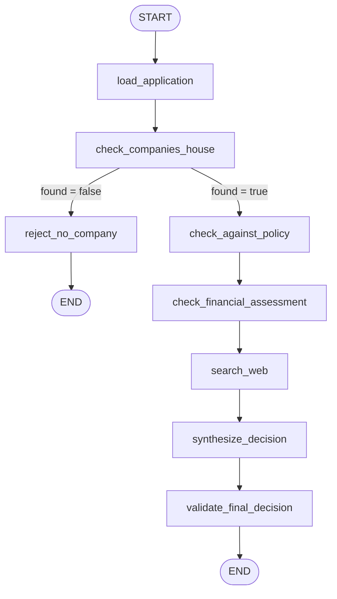

# Loan assessment branching and evidence gathering

This workflow is the operational spine of the loan assessment graph. It starts by loading the application and staged input documents, then routes through a Companies House identity check that determines whether the rest of the assessment runs at all. If the company cannot be confirmed, the graph stops on the rejection branch; if it is confirmed, the graph continues through policy, financial, web-search, and decision synthesis stages in that order.

The ordering matters because each later stage depends on evidence collected earlier. Policy needs the application plus bank statement recency dates. Financial assessment needs the application, policy result, annual accounts, bank statements, and the Companies House lookup as cross-source context. Web search uses the application and Companies House findings, and synthesis consumes the accumulated findings from all prior stages.

## End-to-end control flow

## Loading stage

`load_application` reads `input/application.json` from the application store and fails fast with `FileNotFoundError` if it is missing. It also discovers document blobs under `input/annual_accounts` and `input/bank_statement` by prefix, validates each JSON payload against the relevant Pydantic schema, and returns them as lists in state.

The loader is intentionally generic: `DocumentSpec` describes each staged document type, and `applies_to` can later gate a document type on application content without adding branching logic to the loader itself. That keeps the stage focused on loading and validation rather than business policy.

Important behavior:

- documents are sorted by key before validation, so the workflow sees a stable order;
- invalid documents raise `ValueError` instead of being ignored, because downstream affordability and consistency checks depend on them;
- the loader returns empty lists when no documents are staged, which keeps downstream code simple and avoids missing-key branching.

## Companies House branch as the gatekeeper

`check_companies_house` is the first real decision point after loading. It constructs an agent with the configured model and the relevant tools from the runtime tool registry, plus the special `geo-target___CheckSameArea` tool that is used as part of the Companies House verification itself. The node asks the agent to produce a structured `CompaniesHouseResult`, then persists both the structured result and the extracted tool-call evidence.

This stage has two responsibilities beyond ordinary extraction:

1. It determines whether a matching company was found.
2. It decides whether later stages are allowed to run.

If `found` is true, the node returns `goto="policy_check"`; if false, it returns `goto="reject_no_company"`. That means the companies-house branch is the controller for the rest of the workflow: the policy, financial, and web-search stages only execute when the company identity has been confirmed.

The node also performs a runtime groundedness check over the raw tool calls. That check can only downgrade an asserted match from true to false; it cannot upgrade a false claim. In effect, it prevents a fabricated or unsupported Companies House match from unlocking the downstream pipeline.

## Local tools versus MCP tools

The workflow uses two different tool sources, and the distinction matters:

- `runtime.context.tools` holds the MCP/gateway tools available to agentic nodes.
- `CHECK_TOOLS_POOL` holds deterministic local assessment tools used by policy and financial analysis.

`tools_for(...)` filters either source by name prefix so each stage only sees the capabilities it should use.

Examples:

- Companies House uses gateway tools prefixed with `CompaniesHouse___` plus `geo-target___CheckSameArea`.
- Policy assessment uses local tools from `CHECK_TOOLS_POOL`, with the set of allowed checks declared in the policy text itself.
- Financial assessment uses a local deterministic repayment tool from `CHECK_TOOLS_POOL` and also benefits from deterministic cross-checking code before the agent writes its summary.
- Web search uses the gateway tool prefixed with `websearch-target___WebSearch`.

This split keeps external side effects and deterministic calculations separate. The deterministic tools are available without runtime wiring to remote services, while MCP tools are used only where external lookup or search is actually needed.

## Policy stage

`check_against_policy` loads the policy text directly from the policy store using the loan type in the application. It does not search for policy documents dynamically. It also reads the tool names declared in the policy text, then scopes the local check-tool pool to those names.

The node passes three pieces of evidence into the agent prompt:

- the policy text;
- the application JSON;
- the bank-statement end dates.

The bank statement dates are important because recency and sufficiency are policy questions, not financial questions. That logic belongs here, not in the financial stage.

The stage persists the structured policy result and the tool-call evidence to `policy_check/result.json`. Because the tools are plain functions, their evidence is harvested from agent messages rather than being written by the tools themselves.

## Financial stage

`check_financial_assessment` only runs on the confirmed-company branch. It combines four evidence sources for the agent:

- the application form;
- the Companies House findings;
- annual accounts;
- bank statements.

Before the agent runs, the node also computes a deterministic cross-check of turnover and profit figures using the application, annual accounts, and Companies House data. The agent is expected to carry that comparison through verbatim, not recompute it.

This stage uses a local deterministic repayment tool from `CHECK_TOOLS_POOL` and does not re-implement policy recency checks. Its job is consistency and affordability: compare sources, let the agent summarize, and persist the resulting evidence artifact for later synthesis.

## Web-search stage

`search_web` uses the company name and Companies House findings to guide a web search through the gateway tool. Unlike Companies House, its groundedness signal is audit-only: the node stores whether any tool calls occurred, but it does not use that signal to change graph routing.

That distinction is important. Web search contributes contextual evidence for the final decision, but it does not gate execution or override later stages. The workflow only has one hard branch gate, and that is the Companies House match decision.

## Decision synthesis and validation

After the evidence stages finish, `synthesize_decision` combines the policy, Companies House, financial, and web-search findings into a proposed recommendation. The synthesis node stores both the recommendation and the upstream findings so that reviewers can inspect the reasoning without rebuilding it from separate artifacts.

Validation runs after synthesis and before the graph ends. The overall pattern is therefore:

1. load and validate inputs;
2. confirm the company identity;
3. collect policy evidence;
4. collect financial evidence;
5. collect web evidence;
6. synthesize a recommendation;
7. validate the final decision record.

## Operational invariants and failure semantics

- Missing `input/application.json` stops the run immediately.
- Invalid staged documents stop the run immediately.
- A failed or ungrounded Companies House match prevents all later assessment stages from running.
- Policy and financial stages rely on the loader to have populated their input lists, but they can still operate when those lists are empty; their prompts then reflect the absence of evidence.
- Evidence artifacts are written to stage-specific store keys, which makes the run auditable and keeps state updates separate from persistence.

## Why the ordering matters

The graph is not just a sequence of checks; it is a dependency chain. Companies House decides whether the rest of the assessment is meaningful. Policy needs the bank statement dates before it can judge recency. Financial assessment needs the policy output, because policy tells it what obligations have already been satisfied. Web search is deliberately late so that it can use the more reliable internal findings as context rather than as substitutes.

That sequencing prevents wasted work and preserves explainability: each stage sees the evidence that makes sense for its specific question, and later stages build on verified earlier claims instead of re-deriving them.
